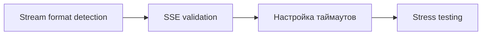
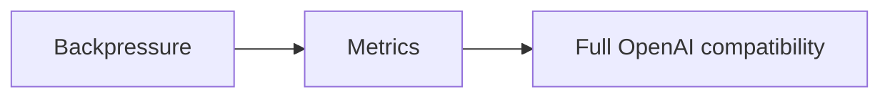

# 🔍 Аудит проекта LLM Router - Отчет о проблемах стриминга

## 📋 Резюме

**Дата аудита:** 2025-10-03  
**Цель:** Выявление причин обрыва стрима при длинных ответах в OpenWebUI  
**Критичность:** 🔴 ВЫСОКАЯ - проблемы приводят к потере данных

---

## 🚨 Критические проблемы (требуют немедленного исправления)

### 1. ⚠️ КРИТИЧНО: Разрыв многобайтных UTF-8 символов между чанками

**Файл:** [`src/services/chat_service.py:163`](src/services/chat_service.py:163)

**Проблема:**
```python
decoded_chunk = chunk.decode('utf-8')  # ❌ Может упасть на границе UTF-8 символа
```

**Почему это происходит:**
- HTTP чанки могут разделить многобайтный UTF-8 символ (например, emoji, кириллица, иероглифы)
- Символ 'й' = `0xD0 0xB9` (2 байта)
- Если чанк заканчивается на `0xD0`, а `0xB9` в следующем - `UnicodeDecodeError`
- Текущее решение: **пропустить чанк** (строка 179) → **потеря данных**

**Влияние:**
- ✅ Английский текст: работает (1 байт на символ)
- ❌ Русский/Unicode: обрывы стрима при длинных ответах
- ❌ Emoji в ответах: гарантированные обрывы
- ❌ OpenWebUI с мультиязычными моделями: нестабильная работа

**Решение:**
```python
# Использовать статeful декодер с буферизацией
decoder = codecs.getincrementaldecoder('utf-8')(errors='ignore')
decoded_chunk = decoder.decode(chunk, final=False)
```

---

### 2. ⚠️ КРИТИЧНО: Отсутствие буферизации для неполных SSE/JSON строк

**Файл:** [`src/services/chat_service.py:165-173`](src/services/chat_service.py:165-173)

**Проблема:**
```python
if decoded_chunk.startswith('data: '):
    full_content, stream_completed_usage = self._process_openai_sse_chunk(...)
    yield chunk  # ❌ Что если 'data: ' разорвано между чанками?
```

**Сценарий поломки:**
```
Chunk 1: "data: {\"id\":\"123\",\"cho"
Chunk 2: "ices\":[{\"delta\":{\"content\":\"Hi\"}}]}\n\n"
```
- Chunk 1 не начинается с полного SSE события → не обрабатывается
- Chunk 2 не начинается с 'data: ' → пропускается

**Влияние:**
- При быстрых ответах провайдера (большие чанки) - работает
- При медленных/дальних провайдерах (малые чанки) - обрывы
- OpenWebUI показывает частичные ответы или зависает

**Решение:**
Буферизация неполных строк:
```python
buffer = b""
async for chunk in response_data.body_iterator:
    buffer += chunk
    lines = buffer.split(b'\n\n')
    buffer = lines[-1]  # Сохранить неполную строку
    for line in lines[:-1]:
        # Обработать полные SSE события
```

---

### 3. ⚠️ ВЫСОКИЙ: JSON parsing без буферизации для Ollama

**Файл:** [`src/services/chat_service.py:223-264`](src/services/chat_service.py:223-264)

**Проблема:**
```python
def _process_ollama_chunk(...):
    for line in decoded_chunk.split('\n'):
        data = json.loads(line)  # ❌ Упадет если JSON разорван
```

**Сценарий:**
```
Chunk 1: "{\"message\":{\"role\":\"assistant\",\"cont"
Chunk 2: "ent\":\"Hello\"},\"done\":false}\n"
```

**Текущее поведение:**
- `JSONDecodeError` → стрим обрывается (строка 183)
- Клиент получает ошибку + `[DONE]` → непредсказуемое состояние

**Решение:**
Буферизация для NDJSON:
```python
json_buffer = ""
for line in lines:
    json_buffer += line
    try:
        data = json.loads(json_buffer)
        json_buffer = ""  # Успешно распарсили
        # обработка...
    except json.JSONDecodeError:
        continue  # Ждем следующий чанк
```

---

## ⚠️ Важные проблемы (влияют на стабильность)

### 4. Некорректная обработка ошибок в стриме

**Файл:** [`src/services/chat_service.py:180-202`](src/services/chat_service.py:180-202)

**Проблемы:**
1. При `JSONDecodeError` → `yield error` + `break` → но потом `yield [DONE]`
2. OpenWebUI может интерпретировать это как успешное завершение
3. Ошибка в SSE формате (строка 310) не соответствует стандарту OpenAI

**Рекомендация:**
```python
# Не отправлять [DONE] после ошибки
stream_error = False
try:
    # stream processing
except:
    stream_error = True
    yield error
    
if not stream_error:
    yield b"data: [DONE]\n\n"
```

---

### 5. Проблемы с определением типа провайдера

**Файл:** [`src/services/chat_service.py:165-175`](src/services/chat_service.py:165-175)

**Проблема:**
```python
if decoded_chunk.startswith('data: '):
    # OpenAI SSE
elif provider_type == "ollama":
    # Ollama NDJSON
else:
    yield chunk  # ❌ Неизвестный формат - пробрасываем как есть
```

**Риски:**
- Если новый провайдер отдает смешанный формат → не обработается
- Anthropic может иметь свой формат → будет пропущен

**Решение:**
Explicit format detection:
```python
# Определить формат по первому чанку
if not format_detected:
    if b'data:' in chunk:
        stream_format = 'sse'
    else:
        stream_format = 'ndjson'
```

---

### 6. Отсутствие валидации SSE формата

**Файл:** [`src/services/chat_service.py:204-221`](src/services/chat_service.py:204-221)

**Проблема:**
SSE может содержать:
- `data: [DONE]` ✅ обрабатывается
- `data: {"error": {...}}` ❌ не обрабатывается
- `:comment\n` (SSE комментарий) ❌ не обрабатывается
- `event: message\ndata: {...}` ❌ не обрабатывается

**Влияние:**
Некоторые провайдеры (OpenRouter, Anthropic) могут отправлять расширенный SSE → ошибки парсинга

---

### 7. Таймауты могут быть слишком большими

**Файлы:** 
- [`src/providers/openai.py:33`](src/providers/openai.py:33)
- [`src/providers/base.py:32`](src/providers/base.py:32)

**Проблема:**
```python
timeout=600  # 10 минут для всех запросов
```

**Риски:**
- Если провайдер зависнет → клиент ждет 10 минут
- OpenWebUI может отключиться раньше → зависший стрим на сервере
- Нет различия между streaming и non-streaming таймаутами

**Рекомендация:**
```python
# Non-streaming: 60 секунд
# Streaming: 300 секунд (5 минут) или динамический
timeout = 300 if stream else 60
```

---

## 🔧 Проблемы архитектуры (долгосрочные улучшения)

### 8. Отсутствие backpressure механизма

**Проблема:**
Если клиент медленно читает, а провайдер быстро отдает данные → накопление в памяти

**Решение:**
Использовать `asyncio.Queue` с ограничением размера

---

### 9. Нет мониторинга "здоровья" стрима

**Проблема:**
Невозможно отследить:
- Сколько чанков потеряно из-за UnicodeDecodeError
- Сколько стримов оборвались некорректно
- Средний размер чанков от разных провайдеров

**Решение:**
Добавить метрики:
```python
stream_metrics = {
    "chunks_processed": 0,
    "chunks_failed": 0,
    "bytes_received": 0,
    "unicode_errors": 0
}
```

---

### 10. Форматирование ошибок не совместимо с OpenAI API

**Файл:** [`src/services/chat_service.py:288-310`](src/services/chat_service.py:288-310)

**Проблема:**
```python
"object": "chat.completion.chunk",  # ❌
"choices": [],                       # ❌
"error": {...}                       # ✅ Но в неправильном месте
```

**OpenAI стандарт для streaming ошибок:**
```python
# Ошибка НЕ должна быть в chunk объекте
# Должна быть отдельным SSE событием
data: {"error": {"message": "...", "type": "...", "code": "..."}}
```

---

## 📊 Приоритеты исправления

### 🔴 КРИТИЧНО (исправить немедленно):
1. ✅ UTF-8 incremental decoder
2. ✅ SSE/JSON буферизация неполных строк
3. ✅ Корректная обработка ошибок (не отправлять [DONE])

### 🟡 ВАЖНО (исправить в ближайшее время):
4. ✅ Определение формата стрима
5. ✅ Валидация SSE формата
6. ✅ Настройка таймаутов

### 🟢 ЖЕЛАТЕЛЬНО (backlog):
7. ✅ Backpressure механизм
8. ✅ Мониторинг и метрики
9. ✅ Полная совместимость с OpenAI error format

---

## 🛠️ План реализации исправлений

### Этап 1: Критические исправления (1-2 дня)


### Этап 2: Улучшение стабильности (2-3 дня)


### Этап 3: Архитектурные улучшения (опционально)


---

## 🧪 Тестовые сценарии для проверки

### Тест 1: Разрыв UTF-8 символов
```python
# Отправить текст с emoji и кириллицей
# Ожидание: стабильный стрим без обрывов
text = "Привет! 👋 Как дела? 🚀"
```

### Тест 2: Длинные ответы
```python
# Запросить ответ >5000 токенов
# Ожидание: полный ответ без обрывов
prompt = "Напиши подробную статью на 3000 слов о..."
```

### Тест 3: Медленный провайдер
```python
# Использовать провайдер с малыми чанками (1-10 байт)
# Ожидание: корректная буферизация и парсинг
```

### Тест 4: Ошибки от провайдера
```python
# Провоцировать ошибки (rate limit, invalid token)
# Ожидание: корректная передача ошибки без [DONE]
```

---

## 📝 Рекомендации для разработки

### Code Review Checklist:
- [ ] Используется incremental UTF-8 decoder для всех стримов
- [ ] Есть буферизация для неполных SSE/JSON строк
- [ ] Error handling не отправляет [DONE] после ошибки
- [ ] Таймауты настроены в зависимости от типа запроса
- [ ] Формат ошибок совместим с OpenAI API

### Мониторинг в production:
- [ ] Логирование всех UnicodeDecodeError с контекстом
- [ ] Метрики по оборванным стримам
- [ ] Алерты на частые JSONDecodeError
- [ ] Dashboard со статистикой по провайдерам

---

## 🔗 Полезные ссылки

- [Server-Sent Events spec](https://html.spec.whatwg.org/multipage/server-sent-events.html)
- [OpenAI Streaming API](https://platform.openai.com/docs/api-reference/streaming)
- [Python codecs.IncrementalDecoder](https://docs.python.org/3/library/codecs.html#codecs.IncrementalDecoder)
- [OpenWebUI GitHub](https://github.com/open-webui/open-webui)

---

## 📌 Выводы

Основная причина обрывов стрима при длинных ответах - **отсутствие буферизации для неполных UTF-8 последовательностей и SSE/JSON строк**.

Текущая реализация работает только когда:
- ✅ Текст чисто английский (1 байт на символ)
- ✅ Провайдер отдает большие чанки (полные SSE события)
- ✅ Нет ошибок от провайдера

При работе с OpenWebUI и мультиязычными моделями эти условия не выполняются → **нестабильная работа**.

**Приоритет:** Немедленное исправление критических проблем (1-3) для стабильной работы с OpenWebUI.