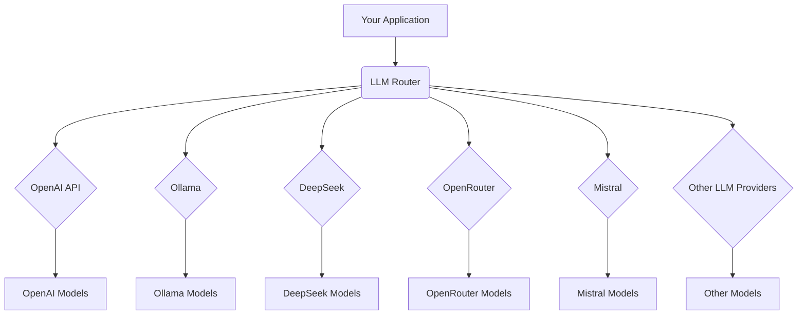

# LLM Router

## TLDR;
**LLM Router** is a unified API gateway for diverse Large Language Models (LLMs) and AI services. It simplifies integration by providing a single OpenAI-compatible endpoint, abstracting away complexities of multiple providers, API keys, and model management. Ideal for developers seeking a streamlined way to access and control various LLMs (OpenAI, Ollama, DeepSeek, etc.) through one consistent interface.

## 🚀 Overview
This project provides a unified and flexible API gateway for various Large Language Models (LLMs) and AI services. It acts as a single entry point, abstracting away the complexities of managing multiple LLM providers, their unique APIs, and diverse authentication methods. For enthusiasts and developers working with a multitude of AI tools (like Ollama, DeepSeek, OpenRouter, OpenAI, Mistral, and more), the LLM Router simplifies integration by offering a single OpenAI-compatible endpoint. This eliminates the need to track individual API keys, handle varying data formats, or constantly monitor model updates across different platforms.

## ✨ Features
*   **Unified API Endpoint:** Provides a single OpenAI-compatible API endpoint for all integrated LLM providers, streamlining your application's interaction with various models.
*   **Flexible Access Control:** Allows granular control over model access. For each API key, you can define a specific list of models that are permitted for use, enhancing security and resource management.
*   **Provider Agnostic:** Seamlessly integrates with different LLM providers, enabling you to switch or combine models from various sources without changing your application's code.
*   **Supported Providers:**
    *   OpenAI-compatible APIs (including Chat Completions, Embeddings, and Speech-to-Text/STT)
    *   Ollama

## 🌐 Supported Endpoints
The LLM Router provides an OpenAI-compatible API interface, supporting the following endpoints:

*   **GET `/health`**: Basic health check to ensure the service is running.
*   **GET `/v1/models`**: Lists all models available through the router, filtered by the API key's permissions.
*   **GET `/v1/models/{model_id}`**: Retrieves detailed information about a specific model.
*   **POST `/v1/chat/completions`**: Handles chat completion requests, routing them to the appropriate LLM provider.
*   **POST `/v1/embeddings`**: Generates embeddings for text inputs using configured embedding models.
*   **POST `/v1/audio/transcriptions`**: Transcribes audio files into text using configured transcription models.

## 🏗️ Architecture
The LLM Router sits between your application and various LLM providers, routing requests to the appropriate service and normalizing responses to an OpenAI-compatible format.



## ⚙️ Configuration
The LLM Router is highly configurable, allowing you to manage API keys, define models, and set up providers through simple YAML files and environment variables. The configuration flow is designed to be logical: first define your providers, then the models that use those providers, and finally the user API keys that grant access to specific models.

### Environment Variables (`.env`)
Create a `.env` file in the project root to store your sensitive API keys. This file is not committed to version control. An example `.env.example` is provided.

```ini
# Example .env file
OPENAI_API_KEY="sk-your-openai-key"
DEEPSEEK_API_KEY="sk-your-deepseek-key"
OPENROUTER_API_KEY="sk-your-openrouter-key"
TABBY_API_KEY="sk-your-tabby-key"
TRANSCRIPTIONS_API_KEY="sk-your-transcriptions-key"
```

### Model and Provider Configuration (`config/` directory)
The `config/` directory contains YAML files that define your providers, models, and user API keys.

#### 1. `config/providers.yaml`
This file configures the details for each LLM provider, including their type, base URL, and the environment variable where their API key is stored.

```yaml
providers:
  openai:
    type: openai
    base_url: https://api.openai.com/v1
    api_key_env: OPENAI_API_KEY
  deepseek:
    type: openai # DeepSeek is OpenAI API compatible
    base_url: https://api.deepseek.com/v1
    api_key_env: DEEPSEEK_API_KEY
  openrouter:
    type: openai # OpenRouter is OpenAI API compatible
    base_url: https://openrouter.ai/api/v1
    api_key_env: OPENROUTER_API_KEY
    headers:
      HTTP-Referer: "https://my.space"
      X-Title: "my llm router"
  orange:  # Local ORANGE server example
    type: openai
    base_url: http://192.168.1.52:5010/v1
    api_key_env: TABBY_API_KEY
  transcriber:
    type: openai
    base_url: http://192.168.1.52:5042/v1
    api_key_env: TRANSCRIPTIONS_API_KEY
  ollama:
    type: ollama
    base_url: http://192.168.1.52:11434/api
```

#### 2. `config/models.yaml`
After defining your providers, this file defines the available models, their associated providers, and any specific configurations. Each model must reference a provider defined in `config/providers.yaml`.

```yaml
models:
  deepseek/chat:
    provider: deepseek
    provider_model_name: deepseek-chat
  deepseek/reasoner:
    provider: deepseek
    provider_model_name: deepseek-reasoner
  anthropic/sonnet:
    provider: openrouter
    provider_model_name: anthropic/claude-sonnet-4
  gemini/mini:
    provider: openrouter
    provider_model_name: google/gemini-2.0-flash-001
  gemini/chat:
    provider: openrouter
    provider_model_name: google/gemini-2.5-flash-preview-05-20
  gemini/pro:
    provider: openrouter
    provider_model_name: google/gemini-2.5-pro
  mistral/mistral-small:
    provider: openrouter
    provider_model_name: mistralai/mistral-small-3.2-24b-instruct
    options:
      provider:
        only: ["mistral"]
  mistral/devstral-small:
    provider: openrouter
    provider_model_name: mistralai/devstral-small
    options:
      provider:
        only: ["mistral"]
  minimax/reasoner:
    provider: openrouter
    provider_model_name: minimax/minimax-m1
    options:
      provider:
        only: ["minimax"]
  local/orange/small:
    provider: orange
    provider_model_name: dummy
  embeddings/dummy:
    provider: orange
    provider_model_name: dummy
    is_hidden: true
  stt/dummy:
    provider: transcriber
    provider_model_name: dummy
    is_hidden: true
  ollama/gemma3n:
    provider: ollama
    provider_model_name: gemma3n
```

#### 3. `config/user_keys.yaml`
Finally, this file defines the API keys that your users will use to access the LLM Router, and which models each key is allowed to access. Each `allowed_models` entry must correspond to a model defined in `config/models.yaml`.

```yaml
user_keys:
  debug:
    api_key: dummy
    allowed_models: [] # Empty list means access to all models
  full:
    api_key: dummy_full
    allowed_models: [] # Empty list means access to all models
  short:
    api_key: dummy_short
    allowed_models: # If list is present, only these models are allowed
      - gemini/chat
      - gemini/pro
      - deepseek/chat
      - deepseek/reasoner
```

## 🚀 Getting Started
To get the LLM Router up and running, you'll need Docker and Docker Compose installed.

### Prerequisites
*   [Docker](https://docs.docker.com/get-docker/)
*   [Docker Compose](https://docs.docker.com/compose/install/)

### Running the Service
Navigate to the project's root directory in your terminal and execute the following command:

```bash
docker compose up -d
```
This command will build the Docker image (if not already built) and start the LLM Router service, accessible by default on `http://localhost:8777`.

## 💡 Usage Examples
Once the LLM Router service is running, you can interact with it using `curl` or any HTTP client. Replace `YOUR_API_KEY` with one of the API keys defined in `config/user_keys.yaml` (e.g., `dummy`, `dummy_full`, `dummy_short`).

### Chat Completions
Send a chat completion request to an LLM.

```bash
curl -X POST http://localhost:8777/v1/chat/completions \
  -H "Content-Type: application/json" \
  -H "Authorization: Bearer YOUR_API_KEY" \
  -d '{
    "model": "deepseek/chat",
    "messages": [
      {"role": "user", "content": "Hello, how are you?"}
    ]
  }'
```

### Embeddings
Generate embeddings for a given text using a configured embedding model.

```bash
curl -X POST http://localhost:8777/v1/embeddings \
  -H "Content-Type: application/json" \
  -H "Authorization: Bearer YOUR_API_KEY" \
  -d '{
    "model": "embeddings/dummy",
    "input": "The quick brown fox jumps over the lazy dog."
  }'
```

### Audio Transcriptions
Transcribe an audio file using a configured transcription model.
*Note: For transcription, you typically need to send a multipart/form-data request.*

```bash
curl -X POST http://localhost:8777/v1/audio/transcriptions \
  -H "Authorization: Bearer YOUR_API_KEY" \
  -F "file=@/path/to/your/audio.ogg" \
  -F "model=stt/dummy" \
  -F "response_format=json"
```
