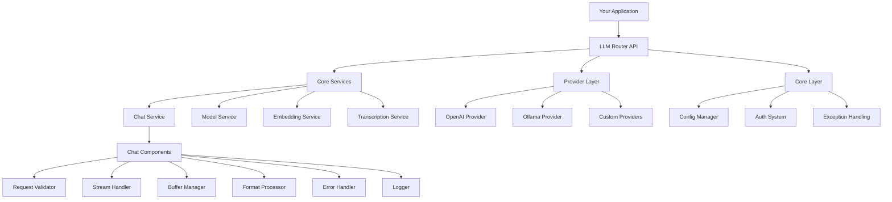

# LLM Router

## TLDR;
**LLM Router** is a unified API gateway for diverse Large Language Models (LLMs) and AI services. Built with modern architecture and SOLID principles, it provides a single OpenAI-compatible endpoint that abstracts away the complexities of multiple providers, API keys, and model management. Perfect for developers who need a robust, scalable solution to access various LLMs (OpenAI, Ollama, DeepSeek, etc.) through one consistent interface.

## 🚀 Overview
LLM Router is a production-ready API gateway that bridges your applications with multiple LLM providers. Built with FastAPI and following SOLID architectural principles, it offers:

- **Modular Architecture**: Clean separation of concerns with specialized components
- **High Performance**: Optimized streaming with UTF-8 handling and efficient buffering
- **Enterprise Security**: Granular access control and API key management
- **Provider Agnostic**: Seamlessly integrate OpenAI-compatible APIs and Ollama
- **Developer Friendly**: OpenAI-compatible API with comprehensive documentation

## ✨ Key Features
*   **Unified API Endpoint**: Single OpenAI-compatible endpoint for all LLM providers
*   **Modular Architecture**: Built with SOLID principles for maintainability and testability
*   **Advanced Streaming**: Optimized UTF-8 processing with buffer management for multi-language support
*   **Flexible Access Control**: Granular model-level permissions per API key
*   **Provider Agnostic**: Easy integration with OpenAI-compatible APIs and Ollama
*   **Production Ready**: Comprehensive error handling, logging, and monitoring
*   **Developer Experience**: OpenAI-compatible API with extensive examples

## 🌐 Supported Endpoints
The LLM Router provides a complete OpenAI-compatible API interface:

*   **GET `/health`**: Service health check and monitoring
*   **GET `/v1/models`**: List available models (filtered by API key permissions)
*   **GET `/v1/models/{model_id}`**: Get detailed model information
*   **POST `/v1/chat/completions`**: Advanced chat completion with streaming support
*   **POST `/v1/embeddings`**: Generate text embeddings with optimized performance
*   **POST `/v1/audio/transcriptions`**: Speech-to-text transcription services

## 🏗️ Architecture
Built with modern software engineering practices, LLM Router features a clean, modular architecture:



### Architecture Highlights
- **Service Layer**: Modular services handling specific functionality
- **Component Architecture**: Each service is composed of specialized components
- **Provider Pattern**: Extensible provider system for easy integration
- **Core Services**: Centralized configuration, authentication, and error handling

## 🚀 Quick Start

### Prerequisites
- [Docker](https://docs.docker.com/get-docker/)
- [Docker Compose](https://docs.docker.com/compose/install/)

### 1. Clone and Setup
```bash
git clone <repository-url>
cd nnp-llm-router
cp .env.example .env  # Configure your API keys
```

### 2. Configure Providers
Edit `config/providers.yaml`:
```yaml
providers:
  openai:
    type: openai
    base_url: https://api.openai.com/v1
    api_key_env: OPENAI_API_KEY
  deepseek:
    type: openai
    base_url: https://api.deepseek.com/v1
    api_key_env: DEEPSEEK_API_KEY
  ollama:
    type: ollama
    base_url: http://localhost:11434/api
```

### 3. Configure Models
Edit `config/models.yaml`:
```yaml
models:
  openai/gpt-4:
    provider: openai
    provider_model_name: gpt-4
  ollama/llama:
    provider: ollama
    provider_model_name: llama3.1
```

### 4. Configure Access
Edit `config/user_keys.yaml`:
```yaml
user_keys:
  developer:
    api_key: your-api-key-here
    allowed_models: []  # Empty = access to all models
  restricted:
    api_key: restricted-key
    allowed_models: ["openai/gpt-4"]
```

### 5. Run the Service
```bash
docker compose up -d
```

The service will be available at `http://localhost:8777`

## 💡 Usage Examples

### Basic Chat Completion
```bash
curl -X POST http://localhost:8777/v1/chat/completions \
  -H "Content-Type: application/json" \
  -H "Authorization: Bearer your-api-key" \
  -d '{
    "model": "openai/gpt-4",
    "messages": [
      {"role": "user", "content": "Hello! Tell me about AI."}
    ],
    "max_tokens": 100
  }'
```

### Streaming Chat with Multi-language Support
```bash
curl -X POST http://localhost:8777/v1/chat/completions \
  -H "Content-Type: application/json" \
  -H "Authorization: Bearer your-api-key" \
  -H "Accept: text/event-stream" \
  -d '{
    "model": "openai/gpt-4",
    "messages": [
      {"role": "user", "content": "Привет! Расскажи о машинном обучении на русском 🤖"}
    ],
    "stream": true,
    "max_tokens": 200
  }'
```

### Generate Embeddings
```bash
curl -X POST http://localhost:8777/v1/embeddings \
  -H "Content-Type: application/json" \
  -H "Authorization: Bearer your-api-key" \
  -d '{
    "model": "openai/text-embedding-ada-002",
    "input": "The quick brown fox jumps over the lazy dog."
  }'
```

### Audio Transcription
```bash
curl -X POST http://localhost:8777/v1/audio/transcriptions \
  -H "Authorization: Bearer your-api-key" \
  -F "file=@audio.mp3" \
  -F "model=whisper/1" \
  -F "response_format=json"
```

## ⚙️ Configuration

### Environment Variables
Create `.env` file in the project root:
```ini
# OpenAI Configuration
OPENAI_API_KEY="sk-your-openai-key"

# DeepSeek Configuration  
DEEPSEEK_API_KEY="sk-your-deepseek-key"

# OpenRouter Configuration
OPENROUTER_API_KEY="sk-your-openrouter-key"

# Custom Providers
TABBY_API_KEY="your-tabby-key"
TRANSCRIPTIONS_API_KEY="your-transcription-key"
```

### Provider Configuration (`config/providers.yaml`)
Define your LLM providers with their specific configurations:

```yaml
providers:
  # OpenAI-Compatible Providers
  openai:
    type: openai
    base_url: https://api.openai.com/v1
    api_key_env: OPENAI_API_KEY
  deepseek:
    type: openai
    base_url: https://api.deepseek.com/v1
    api_key_env: DEEPSEEK_API_KEY
  openrouter:
    type: openai
    base_url: https://openrouter.ai/api/v1
    api_key_env: OPENROUTER_API_KEY
    headers:
      HTTP-Referer: "https://yourapp.com"
      X-Title: "LLM Router"
  
  # Local Providers
  ollama:
    type: ollama
    base_url: http://localhost:11434/api
  tabby:
    type: openai
    base_url: http://localhost:5010/v1
    api_key_env: TABBY_API_KEY
```

### Model Configuration (`config/models.yaml`)
Define available models with their provider mappings:

```yaml
models:
  # OpenAI Models
  openai/gpt-4:
    provider: openai
    provider_model_name: gpt-4
  openai/gpt-3.5:
    provider: openai
    provider_model_name: gpt-3.5-turbo
  
  # DeepSeek Models
  deepseek/chat:
    provider: deepseek
    provider_model_name: deepseek-chat
  deepseek/reasoner:
    provider: deepseek
    provider_model_name: deepseek-reasoner
  
  # Ollama Models
  ollama/llama3:
    provider: ollama
    provider_model_name: llama3.1
  ollama/mistral:
    provider: ollama
    provider_model_name: mistral
  
  # Hidden Models (not listed in /v1/models)
  embeddings/local:
    provider: tabby
    provider_model_name: text-embedding
    is_hidden: true
```

### Access Control (`config/user_keys.yaml`)
Define API keys and their model permissions:

```yaml
user_keys:
  # Full access to all models
  admin:
    api_key: admin-key-123
    allowed_models: []
  
  # Restricted access to specific models
  developer:
    api_key: dev-key-456
    allowed_models:
      - openai/gpt-4
      - deepseek/chat
      - ollama/llama3
  
  # Debug access (limited models)
  debug:
    api_key: debug-key-789
    allowed_models:
      - openai/gpt-3.5
```

## 🔧 Development

### Architecture Overview
The project follows a clean architecture pattern with clear separation of concerns:

```
src/
├── api/                    # FastAPI endpoints and middleware
├── core/                  # Core services (config, auth, exceptions)
├── services/              # Business logic services
│   ├── chat/              # Chat service components
│   ├── embedding_service.py
│   ├── model_service.py
│   └── transcription_service.py
├── providers/             # LLM provider implementations
└── utils/                 # Utility functions
```

### Key Components

#### Chat Service Architecture
The chat service is built with a modular component architecture:

- **Validator**: Request validation and model permissions
- **Logger**: Structured logging with request tracing
- **Stream Handler**: Coordinates streaming operations
- **Buffer Manager**: UTF-8 safe buffer management
- **Format Processor**: Handles SSE/NDJSON format conversion
- **Error Handler**: Streaming error management

#### Provider System
Extensible provider architecture supporting:
- OpenAI-compatible APIs
- Ollama local models
- Custom provider implementations

### Testing
Run the comprehensive test suite:
```bash
# Run all tests
python -m pytest tests/

# Run specific test categories
python tests/test_models.py
python tests/test_streaming_fixes.py
python tests/test_chat_service_refactored.py
```

### Development Setup
```bash
# Install dependencies
pip install -r requirements.txt

# Run in development mode
uvicorn src.api.main:app --reload --host 0.0.0.0 --port 8000

# Run with hot-reload for config
python -m watchfiles uvicorn src.api.main:app --reload
```

## 📊 Performance & Monitoring

### Performance Optimizations
- **UTF-8 Streaming**: Safe handling of multi-byte characters across chunks
- **Buffer Management**: Efficient memory usage for streaming responses
- **Connection Pooling**: Reusable HTTP connections to providers
- **Async Processing**: Non-blocking I/O for high concurrency

### Monitoring
The service includes comprehensive logging:
- Request/response logging with tracing IDs
- Performance metrics (processing time, token counts)
- Error tracking with contextual information
- Provider performance monitoring

### Health Checks
```bash
# Service health
curl http://localhost:8777/health

# Check model availability
curl http://localhost:8777/v1/models
```

## 🔒 Security Features

### Access Control
- API key-based authentication
- Granular model-level permissions
- Request validation and sanitization
- Secure configuration management

### Provider Security
- Secure API key storage via environment variables
- HTTPS enforcement for external providers
- Request/response encryption support
- Rate limiting capabilities

## 🚀 Production Deployment

### Docker Deployment
```bash
# Build and run
docker compose up -d

# Scale for production
docker compose up -d --scale api=3

# Monitor logs
docker compose logs -f api
```

### Environment Variables for Production
```ini
# Performance
UVICORN_WORKERS=4
UVICORN_TIMEOUT=300

# Security
CORS_ORIGINS=https://yourdomain.com
API_KEY_ENCRYPTION=true

# Monitoring
LOG_LEVEL=info
METRICS_ENABLED=true
```

### Monitoring and Observability
- Health check endpoints
- Structured logging with JSON format
- Performance metrics collection
- Error tracking and alerting

## 🤝 Contributing

We welcome contributions! Please see our contributing guidelines:

1. Fork the repository
2. Create a feature branch
3. Follow the existing code style and patterns
4. Add comprehensive tests
5. Submit a pull request with detailed description

## 📄 License

This project is licensed under the MIT License - see the LICENSE file for details.

## 🆘 Support

For support and questions:
- Create an issue on GitHub
- Check the documentation
- Review the test examples
- Join our community discussions

---

**Built with ❤️ using modern Python practices and SOLID architectural principles**
