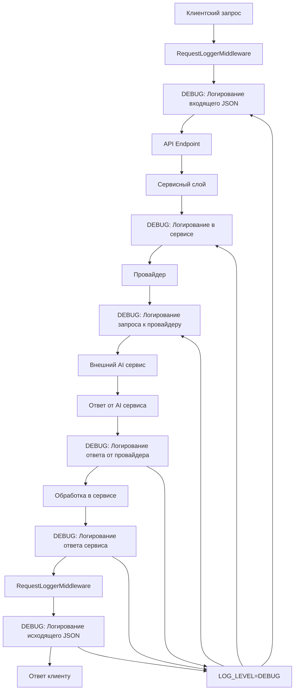
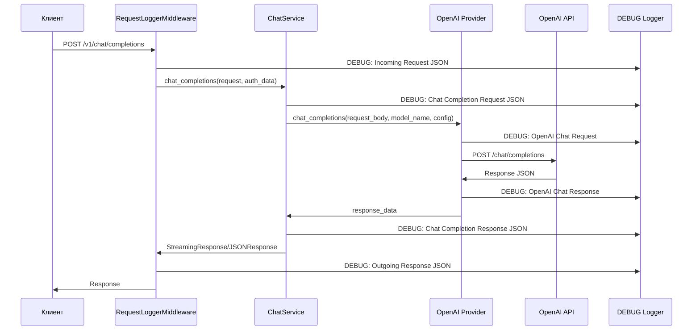
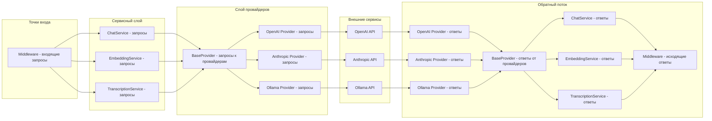
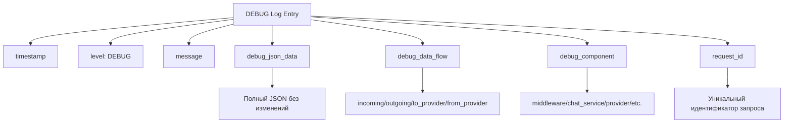
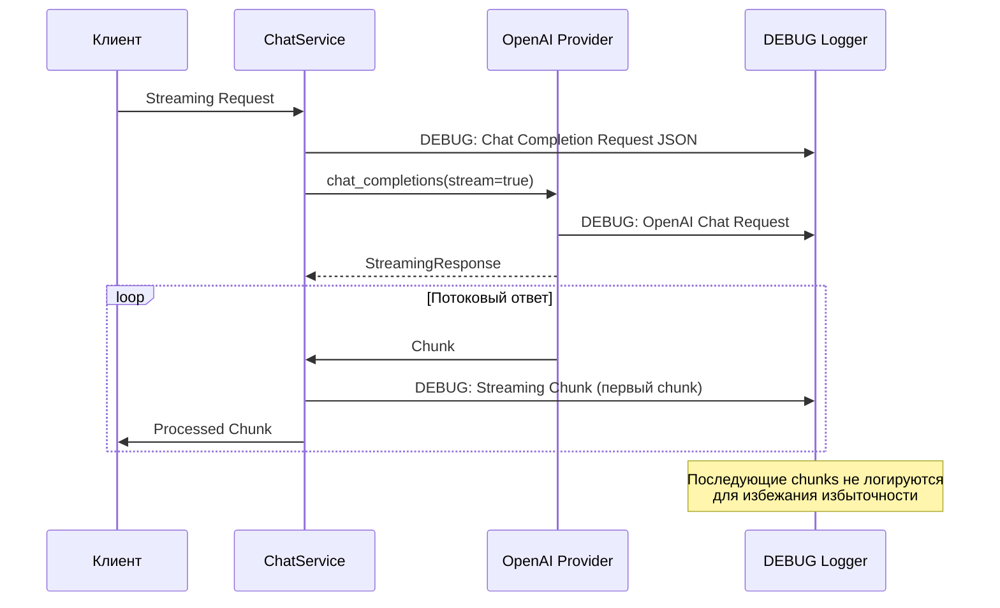
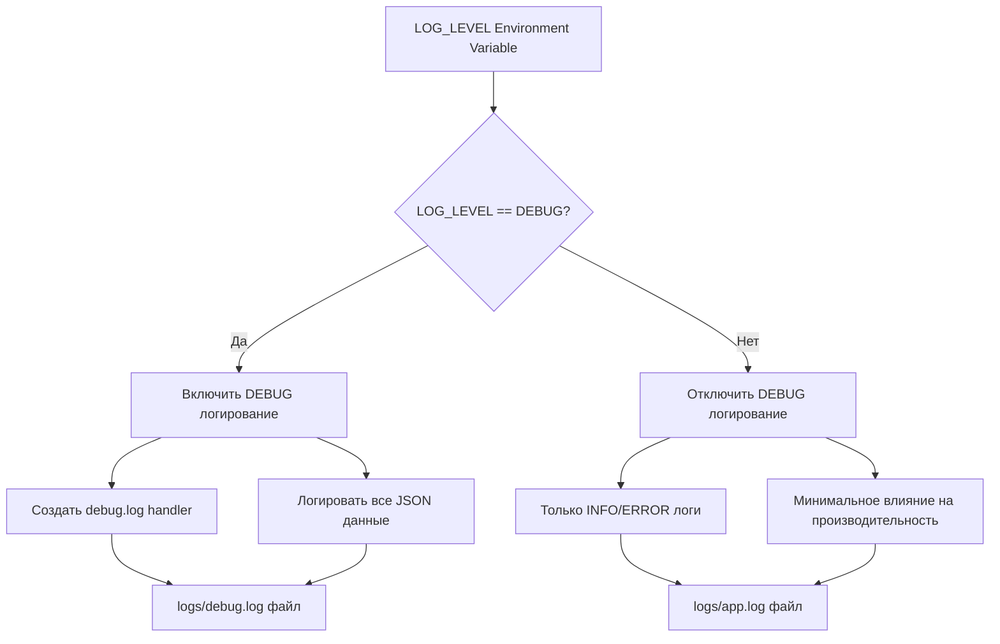

# Диаграмма потока данных для DEBUG логирования

## Общая архитектура потока данных



## Детальная диаграмма для Chat Service



## Точки логирования в системе



## Структура DEBUG лога



## Поток данных для стриминговых ответов



## Конфигурация и управление



## Использование для отладки

```mermaid
graph TD
    A[Редкий баг проявился] --> B[Включить LOG_LEVEL=DEBUG]
    B --> C[Воспроизвести запрос]
    C --> D[Найти request_id в логах]
    D --> E[grep по request_id]
    E --> F[Анализ полного потока данных]
    F --> G[Выявление проблемы]
    G --> H[Исправление]
    H --> I[Отключить DEBUG логирование]
    I --> J[LOG_LEVEL=INFO]