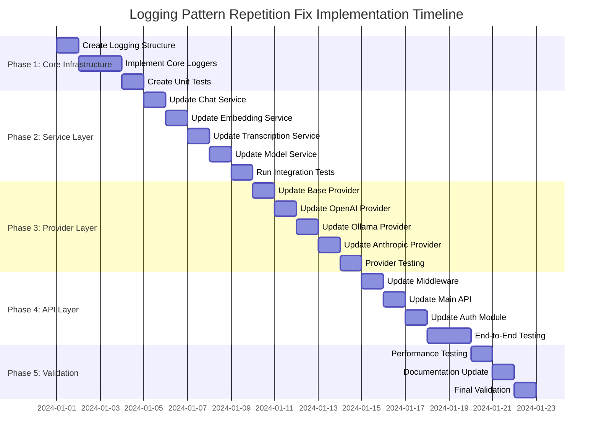

# Logging Pattern Repetition Fix - Detailed Design Plan

## Overview

This document provides a comprehensive design plan to eliminate logging pattern repetition across the LLM Router codebase. The solution involves creating a centralized logging utility system that will replace 72 instances of repetitive logging constructs with a unified, maintainable approach.

## Current Problem Analysis

### 1. Existing Logging Duplication Patterns

#### Pattern 1: Request Logging
Found in multiple services with nearly identical structure:
```python
# Repeated in multiple services
logger.info(
    "Chat Completion Request",
    extra={
        "log_type": "request",
        "request_id": request_id,
        "user_id": user_id,
        "model_id": requested_model,
        "request_body_summary": {
            "model": requested_model,
            "messages_count": len(request_body.get("messages", [])),
            "first_message_content": request_body.get("messages", [{}])[0].get("content")
        }
    }
)
```

#### Pattern 2: Response Logging
```python
# Repeated in multiple services
logger.info(
    "Embedding Creation Response",
    extra={
        "log_type": "response",
        "request_id": request_id,
        "user_id": user_id,
        "model_id": requested_model,
        "http_status_code": 200,
        "prompt_tokens": prompt_tokens,
        "total_tokens": total_tokens
    }
)
```

#### Pattern 3: Error Logging
```python
# Repeated in multiple services
logger.error(
    f"Model '{model_id}' not found in configuration",
    extra={
        "request_id": request_id,
        "user_id": user_id,
        "model_id": model_id,
        "log_type": "error"
    }
)
```

#### Pattern 4: Debug Logging
```python
# Repeated in multiple services
if logger.isEnabledFor(logging.DEBUG):
    logger.debug(
        "DEBUG: Request JSON",
        extra={
            "debug_json_data": request_body,
            "debug_data_flow": "incoming",
            "debug_component": "service_name",
            "request_id": request_id
        }
    )
```

#### Pattern 5: Provider Logging
```python
# Repeated in multiple services
if logger.isEnabledFor(logging.DEBUG):
    logger.debug(
        "DEBUG: Provider Response JSON",
        extra={
            "debug_json_data": response_data,
            "debug_data_flow": "from_provider",
            "debug_component": "provider_name",
            "request_id": request_id
        }
    )
```

### 2. Impact Analysis

**Files Affected**:
- `src/services/chat_service/chat_service.py` (15+ instances)
- `src/services/embedding_service.py` (10+ instances)
- `src/services/transcription_service.py` (8+ instances)
- `src/services/model_service.py` (5+ instances)
- `src/providers/openai.py` (6+ instances)
- `src/providers/ollama.py` (4+ instances)
- `src/providers/anthropic.py` (3+ instances)
- `src/core/auth.py` (3+ instances)
- `src/api/middleware.py` (5+ instances)
- `src/api/main.py` (3+ instances)

**Total Lines of Duplicated Code**: ~400 lines
**Maintenance Overhead**: High - changes require updates in multiple files
**Consistency Issues**: Medium - slight variations in logging format and data

## Proposed Solution Architecture

### 1. Centralized Logging System

#### 1.1 Core Components

```
src/core/logging/
├── __init__.py
├── config.py                 # Logging configuration and setup (migrated from src/logging/config.py)
├── formatter.py              # JSON log formatter (migrated from src/logging/config.py)
├── request_logger.py         # Request/response logging utility
├── debug_logger.py           # Debug logging utility
├── streaming_logger.py       # Streaming response logging utility
├── performance_logger.py     # Performance metrics logging
└── logger_factory.py         # Factory for creating configured logger instances
```

#### 1.2 Design Principles

1. **Single Responsibility**: Each component has a specific logging role
2. **Consistency**: All logs follow the same format and structure
3. **Extensibility**: Easy to add new logging patterns and types
4. **Performance**: Minimal overhead compared to current implementation
5. **Backward Compatibility**: Existing log formats remain unchanged

### 2. Detailed Component Design

#### 2.1 Request Logger (`src/core/logging/request_logger.py`)

```python
import logging
import time
from typing import Dict, Any, Optional, Union
from fastapi import Request

class RequestLogger:
    """Centralized request and response logging utility."""
    
    @staticmethod
    def log_request(
        logger: logging.Logger,
        operation: str,
        request_id: str,
        user_id: str,
        model_id: Optional[str] = None,
        provider_name: Optional[str] = None,
        request_data: Optional[Dict[str, Any]] = None,
        additional_data: Optional[Dict[str, Any]] = None
    ):
        """
        Log incoming request with standardized format.
        
        Args:
            logger: Logger instance to use
            operation: Operation name (e.g., "Chat Completion Request")
            request_id: Unique request identifier
            user_id: User identifier
            model_id: Model identifier if applicable
            provider_name: Provider name if applicable
            request_data: Request data for summary
            additional_data: Additional data to include in log
        """
        log_extra = {
            "log_type": "request",
            "request_id": request_id,
            "user_id": user_id
        }
        
        if model_id:
            log_extra["model_id"] = model_id
        if provider_name:
            log_extra["provider_name"] = provider_name
            
        # Create request body summary
        request_summary = {}
        if request_data:
            if "model" in request_data:
                request_summary["model"] = request_data["model"]
            if "messages" in request_data:
                messages = request_data["messages"]
                request_summary["messages_count"] = len(messages)
                if messages and "content" in messages[0]:
                    request_summary["first_message_content"] = messages[0]["content"][:100] + "..." if len(messages[0]["content"]) > 100 else messages[0]["content"]
            if "input" in request_data:
                input_data = request_data["input"]
                if isinstance(input_data, list):
                    request_summary["input_count"] = len(input_data)
                    request_summary["input_type"] = "list"
                    if input_data and isinstance(input_data[0], str):
                        request_summary["first_input_content"] = input_data[0][:100] + "..." if len(input_data[0]) > 100 else input_data[0]
                elif isinstance(input_data, str):
                    request_summary["input_type"] = "string"
                    request_summary["input_length"] = len(input_data)
                    request_summary["input_content"] = input_data[:100] + "..." if len(input_data) > 100 else input_data
        
        log_extra["request_body_summary"] = request_summary
        
        if additional_data:
            log_extra.update(additional_data)
        
        logger.info(
            operation,
            extra=log_extra
        )
    
    @staticmethod
    def log_response(
        logger: logging.Logger,
        operation: str,
        request_id: str,
        user_id: str,
        model_id: Optional[str] = None,
        provider_name: Optional[str] = None,
        status_code: int = 200,
        response_data: Optional[Dict[str, Any]] = None,
        processing_time_ms: Optional[int] = None,
        token_usage: Optional[Dict[str, int]] = None,
        additional_data: Optional[Dict[str, Any]] = None
    ):
        """
        Log response with standardized format.
        
        Args:
            logger: Logger instance to use
            operation: Operation name (e.g., "Chat Completion Response")
            request_id: Unique request identifier
            user_id: User identifier
            model_id: Model identifier if applicable
            provider_name: Provider name if applicable
            status_code: HTTP status code
            response_data: Response data for summary
            processing_time_ms: Processing time in milliseconds
            token_usage: Token usage information
            additional_data: Additional data to include in log
        """
        log_extra = {
            "log_type": "response",
            "request_id": request_id,
            "user_id": user_id,
            "http_status_code": status_code
        }
        
        if model_id:
            log_extra["model_id"] = model_id
        if provider_name:
            log_extra["provider_name"] = provider_name
        if processing_time_ms:
            log_extra["processing_time_ms"] = processing_time_ms
            
        # Create response body summary
        response_summary = {}
        if response_data:
            if "data" in response_data:
                response_summary["data_length"] = len(response_data["data"])
            if "choices" in response_data:
                response_summary["choices_count"] = len(response_data["choices"])
            if "usage" in response_data:
                usage = response_data["usage"]
                response_summary["prompt_tokens"] = usage.get("prompt_tokens", 0)
                response_summary["completion_tokens"] = usage.get("completion_tokens", 0)
                response_summary["total_tokens"] = usage.get("total_tokens", 0)
            if "object" in response_data:
                response_summary["object_type"] = response_data["object"]
        
        log_extra["response_body_summary"] = response_summary
        
        # Add token usage if provided separately
        if token_usage:
            log_extra.update(token_usage)
        
        if additional_data:
            log_extra.update(additional_data)
        
        logger.info(
            operation,
            extra=log_extra
        )
```

#### 2.2 Debug Logger (`src/core/logging/debug_logger.py`)

```python
import logging
from typing import Dict, Any, Optional

class DebugLogger:
    """Centralized debug logging utility."""
    
    @staticmethod
    def log_data_flow(
        logger: logging.Logger,
        title: str,
        data: Dict[str, Any],
        data_flow: str,
        component: str,
        request_id: str,
        additional_data: Optional[Dict[str, Any]] = None
    ):
        """
        Log data flow for debugging.
        
        Args:
            logger: Logger instance to use
            title: Log title (e.g., "DEBUG: Request JSON")
            data: Data to log
            data_flow: Data flow direction (incoming/outgoing)
            component: Component name
            request_id: Request identifier
            additional_data: Additional data to include in log
        """
        if not logger.isEnabledFor(logging.DEBUG):
            return
        
        log_extra = {
            "debug_json_data": data,
            "debug_data_flow": data_flow,
            "debug_component": component,
            "request_id": request_id
        }
        
        if additional_data:
            log_extra.update(additional_data)
        
        logger.debug(
            title,
            extra=log_extra
        )
    
    @staticmethod
    def log_provider_request(
        logger: logging.Logger,
        provider_name: str,
        url: str,
        headers: Dict[str, str],
        request_body: Dict[str, Any],
        request_id: str
    ):
        """Log provider request for debugging."""
        if not logger.isEnabledFor(logging.DEBUG):
            return
        
        DebugLogger.log_data_flow(
            logger=logger,
            title=f"DEBUG: {provider_name.title()} Request",
            data={
                "url": url,
                "headers": headers,
                "request_body": request_body
            },
            data_flow="to_provider",
            component=f"{provider_name}_provider",
            request_id=request_id
        )
    
    @staticmethod
    def log_provider_response(
        logger: logging.Logger,
        provider_name: str,
        response_data: Dict[str, Any],
        request_id: str
    ):
        """Log provider response for debugging."""
        if not logger.isEnabledFor(logging.DEBUG):
            return
        
        DebugLogger.log_data_flow(
            logger=logger,
            title=f"DEBUG: {provider_name.title()} Response",
            data=response_data,
            data_flow="from_provider",
            component=f"{provider_name}_provider",
            request_id=request_id
        )
```

#### 2.3 Performance Logger (`src/core/logging/performance_logger.py`)

```python
import logging
import time
from typing import Dict, Any, Optional

class PerformanceLogger:
    """Centralized performance logging utility."""
    
    @staticmethod
    def log_operation_timing(
        logger: logging.Logger,
        operation: str,
        start_time: float,
        request_id: str,
        user_id: str,
        model_id: Optional[str] = None,
        additional_metrics: Optional[Dict[str, Any]] = None
    ):
        """
        Log operation timing and performance metrics.
        
        Args:
            logger: Logger instance to use
            operation: Operation name
            start_time: Start time (time.time() result)
            request_id: Request identifier
            user_id: User identifier
            model_id: Model identifier if applicable
            additional_metrics: Additional performance metrics
        """
        end_time = time.time()
        duration_ms = int((end_time - start_time) * 1000)
        
        log_extra = {
            "log_type": "performance",
            "operation": operation,
            "request_id": request_id,
            "user_id": user_id,
            "duration_ms": duration_ms,
            "start_time": start_time,
            "end_time": end_time
        }
        
        if model_id:
            log_extra["model_id"] = model_id
        
        if additional_metrics:
            log_extra.update(additional_metrics)
        
        logger.info(
            f"Performance: {operation}",
            extra=log_extra
        )
    
    @staticmethod
    def create_timing_context(operation: str, request_id: str, user_id: str, model_id: Optional[str] = None) -> Dict[str, Any]:
        """Create a timing context for performance measurement."""
        return {
            "operation": operation,
            "start_time": time.time(),
            "request_id": request_id,
            "user_id": user_id,
            "model_id": model_id
        }
    
    @staticmethod
    def complete_timing_context(
        logger: logging.Logger,
        context: Dict[str, Any],
        additional_metrics: Optional[Dict[str, Any]] = None
    ):
        """Complete a timing context and log the performance metrics."""
        PerformanceLogger.log_operation_timing(
            logger=logger,
            operation=context["operation"],
            start_time=context["start_time"],
            request_id=context["request_id"],
            user_id=context["user_id"],
            model_id=context.get("model_id"),
            additional_metrics=additional_metrics
        )
```

#### 2.4 Streaming Logger (`src/core/logging/streaming_logger.py`)

```python
import logging
from typing import Dict, Any, Optional

class StreamingLogger:
    """Centralized streaming response logging utility."""
    
    @staticmethod
    def log_streaming_start(
        logger: logging.Logger,
        operation: str,
        request_id: str,
        user_id: str,
        model_id: str,
        additional_data: Optional[Dict[str, Any]] = None
    ):
        """Log the start of a streaming response."""
        log_extra = {
            "log_type": "streaming_start",
            "request_id": request_id,
            "user_id": user_id,
            "model_id": model_id,
            "response_type": "streaming"
        }
        
        if additional_data:
            log_extra.update(additional_data)
        
        logger.info(
            f"Initiating {operation}",
            extra=log_extra
        )
    
    @staticmethod
    def log_streaming_end(
        logger: logging.Logger,
        operation: str,
        request_id: str,
        user_id: str,
        model_id: str,
        chunk_count: int,
        processing_time_ms: int,
        token_usage: Optional[Dict[str, int]] = None,
        additional_data: Optional[Dict[str, Any]] = None
    ):
        """Log the end of a streaming response."""
        log_extra = {
            "log_type": "streaming_end",
            "request_id": request_id,
            "user_id": user_id,
            "model_id": model_id,
            "chunk_count": chunk_count,
            "processing_time_ms": processing_time_ms
        }
        
        if token_usage:
            log_extra.update(token_usage)
        
        if additional_data:
            log_extra.update(additional_data)
        
        logger.info(
            f"Completed {operation}",
            extra=log_extra
        )
    
    @staticmethod
    def log_streaming_chunk(
        logger: logging.Logger,
        chunk_data: Dict[str, Any],
        request_id: str,
        user_id: str,
        model_id: str,
        chunk_number: int
    ):
        """Log a streaming chunk (debug level only)."""
        if not logger.isEnabledFor(logging.DEBUG):
            return
        
        log_extra = {
            "log_type": "streaming_chunk",
            "request_id": request_id,
            "user_id": user_id,
            "model_id": model_id,
            "chunk_number": chunk_number,
            "chunk_size": len(str(chunk_data))
        }
        
        logger.debug(
            f"Streaming chunk {chunk_number}",
            extra=log_extra
        )
```

### 3. Implementation Strategy

#### 3.1 Implementation Timeline and Milestones



#### 3.2 Detailed Phase Implementation

##### Phase 1: Core Infrastructure (Days 1-4)

**Day 1: Directory Structure and Basic Setup**
- Create `src/core/logging/` directory structure
- Implement `__init__.py` with proper imports
- Set up basic logger configuration integration
- Create logging utility base classes

**Day 2-3: Core Logger Implementation**
- Migrate `JsonFormatter` from `src/logging/config.py` to `src/core/logging/formatter.py`
- Migrate `setup_logging()` from `src/logging/config.py` to `src/core/logging/config.py`
- Implement `logger_factory.py` for centralized logger management
- Implement `request_logger.py` with request/response logging utilities
- Implement `debug_logger.py` with debug logging utilities
- Implement `performance_logger.py` with performance logging
- Implement `streaming_logger.py` with streaming-specific logging
- Update all imports throughout the codebase

**Day 4: Testing Infrastructure**
- Create comprehensive unit tests for all logging components
- Create test fixtures for logging scenarios
- Set up test logging configuration to avoid interference

##### Phase 2: Service Layer Migration (Days 5-9)

**Day 5: Chat Service Migration**
- Replace all logging patterns in `src/services/chat_service/chat_service.py`
- Maintain exact log output format for backward compatibility
- Test with various chat completion scenarios
- Validate streaming and non-streaming responses

**Day 6: Embedding Service Migration**
- Update `src/services/embedding_service.py`
- Ensure embedding request/response logging consistency
- Test with different input types (string, array)
- Validate token usage logging

**Day 7: Transcription Service Migration**
- Update `src/services/transcription_service.py`
- Handle both direct and proxy transcription requests
- Test with various audio formats and parameters
- Validate debug logging for transcription responses

**Day 8: Model Service Migration**
- Update `src/services/model_service.py`
- Ensure model list and retrieval logging consistency
- Test provider model fetching scenarios
- Validate error logging for model operations

**Day 9: Service Layer Integration Testing**
- Run comprehensive integration tests
- Test cross-service logging consistency
- Validate log formats match existing patterns exactly
- Performance testing for service layer

##### Phase 3: Provider Layer Migration (Days 10-14)

**Day 10: Base Provider Migration**
- Update `src/providers/base.py`
- Implement provider-specific logging patterns
- Update retry mechanism logging
- Test with various provider scenarios

**Day 11: OpenAI Provider Migration**
- Update `src/providers/openai.py`
- Maintain all existing debug logging for requests/responses
- Test with chat, embedding, and transcription endpoints
- Validate error logging patterns

**Day 12: Ollama Provider Migration**
- Update `src/providers/ollama.py`
- Ensure proper request transformation logging
- Test with streaming and non-streaming responses
- Validate timeout and error logging

**Day 13: Anthropic Provider Migration**
- Update `src/providers/anthropic.py`
- Test with variousAnthropic-specific parameters
- Validate message transformation logging
- Test error handling scenarios

**Day 14: Provider Layer Testing**
- Comprehensive provider testing
- Test all provider-specific logging scenarios
- Validate log consistency across providers
- Performance testing for provider layer

##### Phase 4: API Layer Migration (Days 15-18)

**Day 15: Middleware Migration**
- Update `src/api/middleware.py`
- Maintain exact request/response logging format
- Test with various HTTP methods and status codes
- Validate error logging in middleware

**Day 16: Main API Migration**
- Update `src/api/main.py`
- Ensure transcription request logging consistency
- Test with various file formats and parameters
- Validate debug logging patterns

**Day 17: Auth Module Migration**
- Update `src/core/auth.py` if needed
- Ensure authentication logging consistency
- Test with various auth scenarios
- Validate error logging for auth failures

**Day 18-19: End-to-End Testing**
- Complete system testing
- Test all API endpoints with new logging
- Validate log formats match existing exactly
- Performance testing for entire system

##### Phase 5: Validation and Documentation (Days 20-22)

**Day 20: Performance Testing**
- Comprehensive performance testing
- Compare logging overhead before and after
- Validate memory usage impact
- Test under load conditions

**Day 21: Documentation Update**
- Update all relevant documentation
- Create migration guide for developers
- Update logging best practices
- Create troubleshooting guide

**Day 22: Final Validation**
- Complete system validation
- Stakeholder review and approval
- Final performance validation
- Deployment preparation

#### 3.3 Specific Implementation Tasks

##### Task 3.3.1: Create Logging Infrastructure

**Subtask 3.3.1.1: Directory Structure**
```bash
src/core/logging/
├── __init__.py
├── config.py                 # Logging configuration and setup (migrated from src/logging/config.py)
├── formatter.py              # JSON log formatter (migrated from src/logging/config.py)
├── request_logger.py
├── debug_logger.py
├── performance_logger.py
├── streaming_logger.py
└── logger_factory.py         # Factory for creating configured logger instances
```

**Subtask 3.3.1.2: Base Implementation**
- Create abstract base classes for all loggers
- Implement common logging patterns
- Set up configuration integration
- Create utility functions for log data preparation

**Subtask 3.3.1.3: Configuration Migration**
- Migrate `JsonFormatter` class from `src/logging/config.py` to `src/core/logging/formatter.py`
- Migrate `setup_logging()` function from `src/logging/config.py` to `src/core/logging/config.py`
- Create `logger_factory.py` for centralized logger instance management
- Update all imports throughout the codebase to use new location
- Ensure backward compatibility during transition

**Subtask 3.3.1.4: Request Logger Implementation**
- Implement `log_request()` method with all parameters
- Implement `log_response()` method with all parameters
- Create automatic summary generation for requests/responses
- Handle various request/response types (JSON, streaming, etc.)

**Subtask 3.3.1.5: Debug Logger Implementation**
- Implement `log_data_flow()` method
- Implement `log_provider_request()` and `log_provider_response()` methods
- Ensure lazy evaluation for debug logging
- Handle various data types and structures

**Subtask 3.3.1.6: Performance Logger Implementation**
- Implement `log_operation_timing()` method
- Implement context-based timing methods
- Create performance metric collection utilities
- Handle various timing scenarios

**Subtask 3.3.1.7: Streaming Logger Implementation**
- Implement `log_streaming_start()` and `log_streaming_end()` methods
- Implement `log_streaming_chunk()` method
- Handle streaming-specific metrics
- Integrate with stream processor

##### Task 3.3.2: Service Layer Migration

**Subtask 3.3.2.1: Chat Service Migration**
- Replace 15+ logging instances in `chat_service.py`
- Maintain exact log format for backward compatibility
- Handle both streaming and non-streaming scenarios
- Preserve sanitization logging

**Subtask 3.3.2.2: Embedding Service Migration**
- Replace 10+ logging instances in `embedding_service.py`
- Handle various input types correctly
- Preserve token usage logging
- Maintain response summary generation

**Subtask 3.3.2.3: Transcription Service Migration**
- Replace 8+ logging instances in `transcription_service.py`
- Handle both direct and proxy requests
- Preserve parameter logging
- Maintain response logging

**Subtask 3.3.2.4: Model Service Migration**
- Replace 5+ logging instances in `model_service.py`
- Preserve provider error logging
- Maintain model detail logging
- Handle various model operations

##### Task 3.3.3: Provider Layer Migration

**Subtask 3.3.3.1: Base Provider Migration**
- Replace logging in `base.py`
- Update retry mechanism logging
- Preserve request/response debug logging
- Handle error logging patterns

**Subtask 3.3.3.2: OpenAI Provider Migration**
- Replace 6+ logging instances in `openai.py`
- Preserve all debug logging for API calls
- Handle multiple endpoint logging
- Maintain error logging patterns

**Subtask 3.3.3.3: Ollama Provider Migration**
- Replace 4+ logging instances in `ollama.py`
- Handle request transformation logging
- Preserve response logging
- Update error logging

**Subtask 3.3.3.4: Anthropic Provider Migration**
- Replace 3+ logging instances in `anthropic.py`
- Handle message transformation logging
- Preserve response logging
- Update error patterns

##### Task 3.3.4: API Layer Migration

**Subtask 3.3.4.1: Middleware Migration**
- Replace 5+ logging instances in `middleware.py`
- Maintain exact request/response logging
- Preserve error logging patterns
- Handle debug logging correctly

**Subtask 3.3.4.2: Main API Migration**
- Replace 3+ logging instances in `main.py`
- Preserve transcription request logging
- Maintain parameter logging
- Update error patterns

**Subtask 3.3.4.3: Auth Module Migration**
- Update auth logging if needed
- Preserve authentication patterns
- Handle error logging
- Maintain security requirements

#### 3.4 Risk Mitigation Strategies

##### Risk 3.4.1: Backward Compatibility Issues

**Mitigation Strategy:**
- Maintain exact log format and structure
- Preserve all existing log fields and values
- Use feature flags for gradual rollout
- Create comprehensive regression tests

**Implementation:**
```python
# Example: Backward compatibility wrapper
class BackwardCompatibleLogger:
    @staticmethod
    def log_request_with_compatibility(logger, operation, request_id, user_id, **kwargs):
        # Use new logger but maintain exact format
        RequestLogger.log_request(logger, operation, request_id, user_id, **kwargs)
        
        # Validate format matches expected output
        if os.environ.get("VALIDATE_LOG_FORMAT", "false").lower() == "true":
            validate_log_format_matches_existing()
```

##### Risk 3.4.2: Performance Impact

**Mitigation Strategy:**
- Implement lazy evaluation for debug logging
- Use efficient string formatting
- Minimize object creation in logging paths
- Set up performance monitoring

**Implementation:**
```python
# Example: Lazy debug logging
def log_debug_lazy(logger, title, data_factory):
    """Debug logging with lazy data evaluation"""
    if not logger.isEnabledFor(logging.DEBUG):
        return  # Skip entirely if debug is disabled
    
    # Only evaluate data when needed
    debug_data = data_factory() if callable(data_factory) else data_factory
    logger.debug(title, extra={"debug_json_data": debug_data})
```

##### Risk 3.4.3: Integration Issues

**Mitigation Strategy:**
- Phase-by-phase implementation with complete replacement
- Comprehensive testing at each phase before proceeding
- Rollback procedures for each phase
- Integration test automation
- Direct replacement of old logging patterns with new unified approach

**Implementation:**
```python
# Example: Complete replacement approach
# No feature flags - direct replacement of logging patterns
class LoggingMigration:
    @staticmethod
    def replace_logging_patterns():
        """Replace all old logging patterns with new unified approach"""
        # Step 1: Implement new logging infrastructure
        # Step 2: Replace old logging calls in each component
        # Step 3: Remove old logging code (no dual logging)
        # Step 4: Validate functionality matches exactly
```

##### Risk 3.4.4: Data Loss or Corruption

**Mitigation Strategy:**
- Comprehensive testing before deployment
- Validate log output format matches existing exactly
- Create log comparison tools for testing phase only
- Implement comprehensive error handling
- Maintain exact log structure and fields

**Implementation:**
```python
# Example: Validation during testing phase only
def validate_new_logging_format():
    """Validate new logging produces identical output to old logging"""
    # This is only used during testing, not in production
    test_scenarios = generate_test_logging_scenarios()
    
    for scenario in test_scenarios:
        old_output = capture_old_logging_output(scenario)
        new_output = capture_new_logging_output(scenario)
        
        assert_log_formats_match(old_output, new_output)
        assert_all_fields_preserved(old_output, new_output)
    
    # In production: use only new logging system
    # No dual logging, complete replacement
```

#### 3.5 Testing Strategy

##### 3.5.1 Unit Testing

**Test Coverage Requirements:**
- 95% code coverage for all logging components
- 100% coverage for critical logging paths
- Test all log format variations
- Test error handling scenarios

**Test Implementation:**
```python
# tests/core/logging/test_request_logger.py
class TestRequestLogger:
    def test_log_request_basic(self):
        """Test basic request logging functionality"""
        # Test implementation
        
    def test_log_request_with_various_data_types(self):
        """Test request logging with different data types"""
        # Test implementation
        
    def test_log_response_format_consistency(self):
        """Test response logging format matches expected"""
        # Test implementation
        
    def test_performance_impact(self):
        """Test logging performance impact"""
        # Test implementation
```

##### 3.5.2 Integration Testing

**Test Scenarios:**
- End-to-end request/response logging
- Multi-provider logging consistency
- Error logging across components
- Streaming response logging

**Test Implementation:**
```python
# tests/integration/test_logging_integration.py
class TestLoggingIntegration:
    def test_complete_chat_completion_logging(self):
        """Test complete chat completion logging flow"""
        # Test implementation
        
    def test_provider_logging_consistency(self):
        """Test logging consistency across providers"""
        # Test implementation
        
    def test_error_propagation_logging(self):
        """Test error logging across component boundaries"""
        # Test implementation
```

##### 3.5.3 Performance Testing

**Performance Benchmarks:**
- Logging overhead < 0.1ms per request
- Memory usage increase < 5%
- CPU usage increase < 2%
- Throughput impact < 1%

**Test Implementation:**
```python
# tests/performance/test_logging_performance.py
class TestLoggingPerformance:
    def test_request_logging_overhead(self):
        """Test request logging performance overhead"""
        # Test implementation
        
    def test_debug_logging_performance(self):
        """Test debug logging performance when disabled"""
        # Test implementation
        
    def test_memory_usage_impact(self):
        """Test memory usage impact of new logging"""
        # Test implementation
```

##### 3.5.4 Regression Testing

**Regression Test Requirements:**
- Exact log format matching
- All existing log fields preserved
- No log data loss
- Consistent log structure

**Test Implementation:**
```python
# tests/regression/test_log_format_regression.py
class TestLogFormatRegression:
    def test_log_format_matches_existing(self):
        """Test new log format matches existing exactly"""
        # Test implementation
        
    def test_all_log_fields_preserved(self):
        """Test all existing log fields are preserved"""
        # Test implementation
        
    def test_log_structure_consistency(self):
        """Test log structure consistency across components"""
        # Test implementation
```

#### 3.6 Rollback Procedures

##### 3.6.1 Phase-by-Phase Rollback

**Phase 1 Rollback (Core Infrastructure):**
- Remove new logging directory
- Restore original logging imports
- Restart services
- Validate functionality

**Phase 2 Rollback (Service Layer):**
- Revert service files to original versions
- Restore original logging patterns
- Restart services
- Run integration tests

**Phase 3 Rollback (Provider Layer):**
- Revert provider files to original versions
- Restore original provider logging
- Restart services
- Test provider functionality

**Phase 4 Rollback (API Layer):**
- Revert API files to original versions
- Restore original API logging
- Restart services
- Test API endpoints

##### 3.6.2 Automated Rollback

**Rollback Script:**
```bash
#!/bin/bash
# rollback_logging_changes.sh

echo "Starting logging changes rollback..."

# Phase 4: API Layer
git checkout HEAD~1 -- src/api/middleware.py src/api/main.py src/core/auth.py

# Phase 3: Provider Layer
git checkout HEAD~1 -- src/providers/openai.py src/providers/ollama.py src/providers/anthropic.py src/providers/base.py

# Phase 2: Service Layer
git checkout HEAD~1 -- src/services/chat_service/chat_service.py src/services/embedding_service.py src/services/transcription_service.py src/services/model_service.py

# Phase 1: Core Infrastructure
rm -rf src/core/logging/
git checkout HEAD~1 -- src/logging/config.py
# Restore original logging configuration location

# Restart services
systemctl restart nnp-llm-router

echo "Rollback completed. Services restarted."
```

##### 3.6.3 Validation After Rollback

**Validation Checklist:**
- [ ] All services start successfully
- [ ] API endpoints respond correctly
- [ ] Log formats match original
- [ ] No errors in service logs
- [ ] Performance is restored to baseline

#### 3.7 Integration Points and Dependencies

##### 3.7.1 Configuration Dependencies

**Configuration Integration:**
- Integration with `src/logging/config.py`
- Environment variable dependencies
- Log level configuration
- Output format configuration

**Implementation:**
```python
# Integration with existing configuration
from src.logging.config import logger, setup_logging

class LoggingIntegration:
    @staticmethod
    def integrate_with_existing_config():
        """Integrate new logging with existing configuration"""
        # Ensure logger instance is shared
        # Maintain existing log levels
        # Preserve output formats
```

##### 3.7.2 Error Handling Integration

**Error Handler Integration:**
- Integration with `src/core/error_handling/error_handler.py`
- Integration with `src/core/error_handling/error_logger.py`
- Consistent error context handling
- Unified error logging format

**Implementation:**
```python
# Integration with error handling
from src.core.error_handling import ErrorLogger, ErrorContext

class ErrorLoggingIntegration:
    @staticmethod
    def integrate_with_error_handling():
        """Integrate new logging with error handling"""
        # Maintain error context
        # Preserve error log format
        # Ensure consistent error reporting
```

##### 3.7.3 Service Dependencies

**Service Integration Points:**
- Chat service integration
- Embedding service integration
- Transcription service integration
- Model service integration
- Provider integration

**Dependency Management:**
```python
# Service dependency management
class ServiceLoggingDependency:
    def __init__(self, config_manager, httpx_client):
        self.config_manager = config_manager
        self.httpx_client = httpx_client
        self.initialize_logging()
    
    def initialize_logging(self):
        """Initialize logging for all services"""
        # Set up service-specific logging
        # Configure provider logging
        # Initialize performance logging
```

#### 3.8 Performance Monitoring Approach

##### 3.8.1 Monitoring Metrics

**Key Performance Indicators:**
- Logging overhead per request
- Memory usage impact
- CPU usage impact
- Throughput impact
- Error rates

**Implementation:**
```python
# Performance monitoring implementation
class LoggingPerformanceMonitor:
    def __init__(self):
        self.metrics = {
            'logging_overhead': [],
            'memory_usage': [],
            'cpu_usage': [],
            'throughput_impact': [],
            'error_rates': []
        }
    
    def measure_logging_overhead(self, operation):
        """Measure logging overhead for specific operation"""
        # Implementation
    
    def monitor_memory_usage(self):
        """Monitor memory usage impact"""
        # Implementation
    
    def generate_performance_report(self):
        """Generate comprehensive performance report"""
        # Implementation
```

##### 3.8.2 Alerting Thresholds

**Alert Configuration:**
- Logging overhead > 0.2ms per request
- Memory usage increase > 10%
- CPU usage increase > 5%
- Throughput impact > 2%
- Error rate increase > 1%

**Implementation:**
```python
# Alerting implementation
class LoggingAlertManager:
    def __init__(self):
        self.thresholds = {
            'max_logging_overhead': 0.2,  # ms
            'max_memory_increase': 10,    # percentage
            'max_cpu_increase': 5,        # percentage
            'max_throughput_impact': 2,   # percentage
            'max_error_rate_increase': 1  # percentage
        }
    
    def check_thresholds(self, metrics):
        """Check if metrics exceed thresholds"""
        # Implementation
    
    def send_alert(self, alert_type, details):
        """Send alert if thresholds exceeded"""
        # Implementation
```

##### 3.8.3 Continuous Monitoring

**Monitoring Strategy:**
- Real-time performance monitoring
- Automated regression detection
- Continuous performance validation
- Historical trend analysis

**Implementation:**
```python
# Continuous monitoring implementation
class ContinuousLoggingMonitor:
    def __init__(self):
        self.monitoring_active = True
        self.baseline_metrics = self.establish_baseline()
    
    def start_continuous_monitoring(self):
        """Start continuous monitoring process"""
        # Implementation
    
    def detect_performance_regression(self):
        """Detect performance regression automatically"""
        # Implementation
    
    def analyze_trends(self):
        """Analyze performance trends over time"""
        # Implementation
```

#### 3.9 Detailed Code Examples

##### 3.9.1 Core Logger Implementation Examples

**Configuration Migration:**
```python
# src/core/logging/config.py (MIGRATED FROM src/logging/config.py)
import logging
import json
import os
from .formatter import JsonFormatter

def setup_logging():
    """Setup logging configuration with handlers and formatters."""
    # Get log level from environment variable
    log_level = os.environ.get("LOG_LEVEL", "INFO").upper()
    
    logger = logging.getLogger("nnp-llm-router")
    logger.setLevel(getattr(logging, log_level))

    # Ensure logs directory exists
    LOG_DIR = "logs"
    os.makedirs(LOG_DIR, exist_ok=True)
    LOG_FILE = os.path.join(LOG_DIR, "app.log")

    # File handler for general logs
    file_handler = logging.FileHandler(LOG_FILE)
    file_formatter = JsonFormatter(datefmt="%Y-%m-%dT%H:%M:%S%z")
    file_handler.setFormatter(file_formatter)
    file_handler.setLevel(logging.INFO)  # Always at least INFO level for main log
    logger.addHandler(file_handler)

    # DEBUG log handler - separate file for debug logs
    if log_level == "DEBUG":
        DEBUG_LOG_FILE = os.path.join(LOG_DIR, "debug.log")
        debug_handler = logging.FileHandler(DEBUG_LOG_FILE)
        debug_handler.setFormatter(JsonFormatter(datefmt="%Y-%m-%dT%H:%M:%S%z"))
        debug_handler.setLevel(logging.DEBUG)
        logger.addHandler(debug_handler)
        
        # Also add DEBUG to console if in debug mode
        console_handler = logging.StreamHandler()
        console_formatter = logging.Formatter("%(asctime)s - %(name)s - %(levelname)s - %(message)s")
        console_handler.setFormatter(console_formatter)
        console_handler.setLevel(logging.DEBUG)
        logger.addHandler(console_handler)
    else:
        # Console handler for non-debug mode
        console_handler = logging.StreamHandler()
        console_formatter = logging.Formatter("%(asctime)s - %(name)s - %(levelname)s - %(message)s")
        console_handler.setFormatter(console_formatter)
        console_handler.setLevel(logging.INFO)
        logger.addHandler(console_handler)

    # Ensure logger propagates to handlers
    logger.propagate = True
    
    return logger

# Initialize the global logger instance
logger = setup_logging()
```

```python
# src/core/logging/formatter.py (MIGRATED FROM src/logging/config.py)
import logging
import json

class JsonFormatter(logging.Formatter):
    """JSON formatter for structured logging."""
    
    def format(self, record):
        log_record = {
            "timestamp": self.formatTime(record, self.datefmt),
            "level": record.levelname,
            "message": record.getMessage(),
        }
        
        # Add custom attributes from the 'extra' dictionary if they exist
        # These are the fields we explicitly pass in our logger.info calls
        if hasattr(record, 'request_id'):
            log_record['request_id'] = record.request_id
        if hasattr(record, 'user_id'):
            log_record['user_id'] = record.user_id
        if hasattr(record, 'model_id'):
            log_record['model_id'] = record.model_id
        if hasattr(record, 'log_type'):
            log_record['log_type'] = record.log_type
        if hasattr(record, 'method'):
            log_record['method'] = record.method
        if hasattr(record, 'url'):
            log_record['url'] = record.url
        if hasattr(record, 'request_body_summary'):
            log_record['request_body_summary'] = record.request_body_summary
        if hasattr(record, 'http_status_code'):
            log_record['http_status_code'] = record.http_status_code
        if hasattr(record, 'process_time_ms'):
            log_record['process_time_ms'] = record.process_time_ms
        if hasattr(record, 'prompt_tokens'):
            log_record['prompt_tokens'] = record.prompt_tokens
        if hasattr(record, 'completion_tokens'):
            log_record['completion_tokens'] = record.completion_tokens
        if hasattr(record, 'total_tokens'):
            log_record['total_tokens'] = record.total_tokens
        if hasattr(record, 'prompt_cost'):
            log_record['prompt_cost'] = record.prompt_cost
        if hasattr(record, 'completion_cost'):
            log_record['completion_cost'] = record.completion_cost
        if hasattr(record, 'total_cost'):
            log_record['total_cost'] = record.total_cost
        if hasattr(record, 'response_body_summary'):
            log_record['response_body_summary'] = record.response_body_summary
        if hasattr(record, 'error_message'):
            log_record['error_message'] = record.error_message
        if hasattr(record, 'error_code'):
            log_record['error_code'] = record.error_code
        if hasattr(record, 'http_status_code'):
            log_record['http_status_code'] = record.http_status_code
        if hasattr(record, 'detail'): # For HTTPException details
            log_record['detail'] = record.detail
        if hasattr(record, 'api_key'): # For logging sensitive info in errors, if needed
            log_record['api_key'] = record.api_key
        if hasattr(record, 'project_name'): # For logging sensitive info in errors, if needed
            log_record['project_name'] = record.project_name
        
        # DEBUG logging fields for full JSON data logging
        if hasattr(record, 'debug_json_data'):
            log_record['debug_json_data'] = record.debug_json_data
        if hasattr(record, 'debug_data_flow'):
            log_record['debug_data_flow'] = record.debug_data_flow  # 'incoming', 'outgoing', 'to_provider', 'from_provider'
        if hasattr(record, 'debug_component'):
            log_record['debug_component'] = record.debug_component  # 'middleware', 'chat_service', 'provider', etc.
        
        # Handle exception information
        if record.exc_info:
            log_record['exc_info'] = self.formatException(record.exc_info)
        
        return json.dumps(log_record, ensure_ascii=False)
```

```python
# src/core/logging/logger_factory.py (NEW COMPONENT)
import logging
from typing import Optional

class LoggerFactory:
    """Factory for creating and managing logger instances."""
    
    @staticmethod
    def get_logger(name: Optional[str] = None) -> logging.Logger:
        """
        Get a configured logger instance.
        
        Args:
            name: Optional logger name. If None, returns the default 'nnp-llm-router' logger.
            
        Returns:
            Configured logger instance
        """
        if name is None:
            return logging.getLogger("nnp-llm-router")
        return logging.getLogger(name)
    
    @staticmethod
    def is_debug_enabled(logger: logging.Logger) -> bool:
        """Check if debug logging is enabled for the given logger."""
        return logger.isEnabledFor(logging.DEBUG)
```

```python
# src/core/logging/__init__.py (UPDATED)
from .config import logger, setup_logging
from .formatter import JsonFormatter
from .logger_factory import LoggerFactory
from .request_logger import RequestLogger
from .debug_logger import DebugLogger
from .performance_logger import PerformanceLogger
from .streaming_logger import StreamingLogger

# Export main components for easy import
__all__ = [
    'logger',
    'setup_logging',
    'JsonFormatter',
    'LoggerFactory',
    'RequestLogger',
    'DebugLogger',
    'PerformanceLogger',
    'StreamingLogger'
]
```

**Request Logger Implementation:**
```python
# src/core/logging/request_logger.py
import logging
import time
from typing import Dict, Any, Optional, Union
from fastapi import Request

class RequestLogger:
    """Centralized request and response logging utility."""
    
    @staticmethod
    def log_request(
        logger: logging.Logger,
        operation: str,
        request_id: str,
        user_id: str,
        model_id: Optional[str] = None,
        provider_name: Optional[str] = None,
        request_data: Optional[Dict[str, Any]] = None,
        additional_data: Optional[Dict[str, Any]] = None
    ):
        """
        Log incoming request with standardized format.
        
        Example usage:
        ```python
        RequestLogger.log_request(
            logger=logger,
            operation="Chat Completion Request",
            request_id=request_id,
            user_id=user_id,
            model_id=requested_model,
            request_data=request_body
        )
        ```
        """
        log_extra = {
            "log_type": "request",
            "request_id": request_id,
            "user_id": user_id
        }
        
        if model_id:
            log_extra["model_id"] = model_id
        if provider_name:
            log_extra["provider_name"] = provider_name
            
        # Create request body summary
        request_summary = {}
        if request_data:
            if "model" in request_data:
                request_summary["model"] = request_data["model"]
            if "messages" in request_data:
                messages = request_data["messages"]
                request_summary["messages_count"] = len(messages)
                if messages and "content" in messages[0]:
                    content = messages[0]["content"]
                    request_summary["first_message_content"] = (
                        content[:100] + "..." if len(content) > 100 else content
                    )
            if "input" in request_data:
                input_data = request_data["input"]
                if isinstance(input_data, list):
                    request_summary["input_count"] = len(input_data)
                    request_summary["input_type"] = "list"
                    if input_data and isinstance(input_data[0], str):
                        content = input_data[0]
                        request_summary["first_input_content"] = (
                            content[:100] + "..." if len(content) > 100 else content
                        )
                elif isinstance(input_data, str):
                    request_summary["input_type"] = "string"
                    request_summary["input_length"] = len(input_data)
                    request_summary["input_content"] = (
                        input_data[:100] + "..." if len(input_data) > 100 else input_data
                    )
        
        log_extra["request_body_summary"] = request_summary
        
        if additional_data:
            log_extra.update(additional_data)
        
        logger.info(operation, extra=log_extra)
    
    @staticmethod
    def log_response(
        logger: logging.Logger,
        operation: str,
        request_id: str,
        user_id: str,
        model_id: Optional[str] = None,
        provider_name: Optional[str] = None,
        status_code: int = 200,
        response_data: Optional[Dict[str, Any]] = None,
        processing_time_ms: Optional[int] = None,
        token_usage: Optional[Dict[str, int]] = None,
        additional_data: Optional[Dict[str, Any]] = None
    ):
        """
        Log response with standardized format.
        
        Example usage:
        ```python
        RequestLogger.log_response(
            logger=logger,
            operation="Chat Completion Response",
            request_id=request_id,
            user_id=user_id,
            model_id=requested_model,
            status_code=200,
            response_data=response_data,
            processing_time_ms=processing_time
        )
        ```
        """
        log_extra = {
            "log_type": "response",
            "request_id": request_id,
            "user_id": user_id,
            "http_status_code": status_code
        }
        
        if model_id:
            log_extra["model_id"] = model_id
        if provider_name:
            log_extra["provider_name"] = provider_name
        if processing_time_ms:
            log_extra["processing_time_ms"] = processing_time_ms
            
        # Create response body summary
        response_summary = {}
        if response_data:
            if "data" in response_data:
                response_summary["data_length"] = len(response_data["data"])
            if "choices" in response_data:
                response_summary["choices_count"] = len(response_data["choices"])
            if "usage" in response_data:
                usage = response_data["usage"]
                response_summary["prompt_tokens"] = usage.get("prompt_tokens", 0)
                response_summary["completion_tokens"] = usage.get("completion_tokens", 0)
                response_summary["total_tokens"] = usage.get("total_tokens", 0)
            if "object" in response_data:
                response_summary["object_type"] = response_data["object"]
        
        log_extra["response_body_summary"] = response_summary
        
        # Add token usage if provided separately
        if token_usage:
            log_extra.update(token_usage)
        
        if additional_data:
            log_extra.update(additional_data)
        
        logger.info(operation, extra=log_extra)
```

**Debug Logger Implementation:**
```python
# src/core/logging/debug_logger.py
import logging
from typing import Dict, Any, Optional, Callable

class DebugLogger:
    """Centralized debug logging utility with lazy evaluation."""
    
    @staticmethod
    def log_data_flow(
        logger: logging.Logger,
        title: str,
        data: Union[Dict[str, Any], Callable[[], Dict[str, Any]]],
        data_flow: str,
        component: str,
        request_id: str,
        additional_data: Optional[Dict[str, Any]] = None
    ):
        """
        Log data flow for debugging with lazy evaluation.
        
        Example usage:
        ```python
        # Direct data
        DebugLogger.log_data_flow(
            logger=logger,
            title="DEBUG: Request JSON",
            data=request_body,
            data_flow="incoming",
            component="chat_service",
            request_id=request_id
        )
        
        # Lazy evaluation (for expensive data creation)
        DebugLogger.log_data_flow(
            logger=logger,
            title="DEBUG: Complex Data",
            data=lambda: create_expensive_debug_data(),
            data_flow="processing",
            component="analytics",
            request_id=request_id
        )
        ```
        """
        if not logger.isEnabledFor(logging.DEBUG):
            return  # Skip entirely if debug is disabled
        
        # Lazy evaluation of data if callable
        debug_data = data() if callable(data) else data
        
        log_extra = {
            "debug_json_data": debug_data,
            "debug_data_flow": data_flow,
            "debug_component": component,
            "request_id": request_id
        }
        
        if additional_data:
            log_extra.update(additional_data)
        
        logger.debug(title, extra=log_extra)
    
    @staticmethod
    def log_provider_request(
        logger: logging.Logger,
        provider_name: str,
        url: str,
        headers: Dict[str, str],
        request_body: Dict[str, Any],
        request_id: str,
        additional_data: Optional[Dict[str, Any]] = None
    ):
        """Log provider request for debugging."""
        if not logger.isEnabledFor(logging.DEBUG):
            return
        
        DebugLogger.log_data_flow(
            logger=logger,
            title=f"DEBUG: {provider_name.title()} Request",
            data={
                "url": url,
                "headers": headers,
                "request_body": request_body
            },
            data_flow="to_provider",
            component=f"{provider_name}_provider",
            request_id=request_id,
            additional_data=additional_data
        )
    
    @staticmethod
    def log_provider_response(
        logger: logging.Logger,
        provider_name: str,
        response_data: Union[Dict[str, Any], Callable[[], Dict[str, Any]]],
        request_id: str,
        additional_data: Optional[Dict[str, Any]] = None
    ):
        """Log provider response for debugging."""
        if not logger.isEnabledFor(logging.DEBUG):
            return
        
        DebugLogger.log_data_flow(
            logger=logger,
            title=f"DEBUG: {provider_name.title()} Response",
            data=response_data,
            data_flow="from_provider",
            component=f"{provider_name}_provider",
            request_id=request_id,
            additional_data=additional_data
        )
```

**Performance Logger Implementation:**
```python
# src/core/logging/performance_logger.py
import logging
import time
from typing import Dict, Any, Optional, ContextManager
from contextlib import contextmanager

class PerformanceLogger:
    """Centralized performance logging utility."""
    
    @staticmethod
    def log_operation_timing(
        logger: logging.Logger,
        operation: str,
        start_time: float,
        request_id: str,
        user_id: str,
        model_id: Optional[str] = None,
        additional_metrics: Optional[Dict[str, Any]] = None
    ):
        """
        Log operation timing and performance metrics.
        
        Example usage:
        ```python
        start_time = time.time()
        # ... perform operation ...
        PerformanceLogger.log_operation_timing(
            logger=logger,
            operation="Chat Completion",
            start_time=start_time,
            request_id=request_id,
            user_id=user_id,
            model_id=model_id
        )
        ```
        """
        end_time = time.time()
        duration_ms = int((end_time - start_time) * 1000)
        
        log_extra = {
            "log_type": "performance",
            "operation": operation,
            "request_id": request_id,
            "user_id": user_id,
            "duration_ms": duration_ms,
            "start_time": start_time,
            "end_time": end_time
        }
        
        if model_id:
            log_extra["model_id"] = model_id
        
        if additional_metrics:
            log_extra.update(additional_metrics)
        
        logger.info(f"Performance: {operation}", extra=log_extra)
    
    @staticmethod
    def create_timing_context(operation: str, request_id: str, user_id: str, model_id: Optional[str] = None) -> Dict[str, Any]:
        """Create a timing context for performance measurement."""
        return {
            "operation": operation,
            "start_time": time.time(),
            "request_id": request_id,
            "user_id": user_id,
            "model_id": model_id
        }
    
    @staticmethod
    def complete_timing_context(
        logger: logging.Logger,
        context: Dict[str, Any],
        additional_metrics: Optional[Dict[str, Any]] = None
    ):
        """Complete a timing context and log the performance metrics."""
        PerformanceLogger.log_operation_timing(
            logger=logger,
            operation=context["operation"],
            start_time=context["start_time"],
            request_id=context["request_id"],
            user_id=context["user_id"],
            model_id=context.get("model_id"),
            additional_metrics=additional_metrics
        )
    
    @staticmethod
    @contextmanager
    def timing_context(
        logger: logging.Logger,
        operation: str,
        request_id: str,
        user_id: str,
        model_id: Optional[str] = None,
        additional_metrics: Optional[Dict[str, Any]] = None
    ):
        """
        Context manager for automatic timing measurement.
        
        Example usage:
        ```python
        with PerformanceLogger.timing_context(
            logger=logger,
            operation="Chat Completion",
            request_id=request_id,
            user_id=user_id,
            model_id=model_id
        ):
            # ... perform operation ...
            result = provider.chat_completions(...)
        ```
        """
        start_time = time.time()
        try:
            yield
        finally:
            PerformanceLogger.log_operation_timing(
                logger=logger,
                operation=operation,
                start_time=start_time,
                request_id=request_id,
                user_id=user_id,
                model_id=model_id,
                additional_metrics=additional_metrics
            )
```

**Streaming Logger Implementation:**
```python
# src/core/logging/streaming_logger.py
import logging
from typing import Dict, Any, Optional

class StreamingLogger:
    """Centralized streaming response logging utility."""
    
    @staticmethod
    def log_streaming_start(
        logger: logging.Logger,
        operation: str,
        request_id: str,
        user_id: str,
        model_id: str,
        additional_data: Optional[Dict[str, Any]] = None
    ):
        """Log the start of a streaming response."""
        log_extra = {
            "log_type": "streaming_start",
            "request_id": request_id,
            "user_id": user_id,
            "model_id": model_id,
            "response_type": "streaming"
        }
        
        if additional_data:
            log_extra.update(additional_data)
        
        logger.info(f"Initiating {operation}", extra=log_extra)
    
    @staticmethod
    def log_streaming_end(
        logger: logging.Logger,
        operation: str,
        request_id: str,
        user_id: str,
        model_id: str,
        chunk_count: int,
        processing_time_ms: int,
        token_usage: Optional[Dict[str, int]] = None,
        additional_data: Optional[Dict[str, Any]] = None
    ):
        """Log the end of a streaming response."""
        log_extra = {
            "log_type": "streaming_end",
            "request_id": request_id,
            "user_id": user_id,
            "model_id": model_id,
            "chunk_count": chunk_count,
            "processing_time_ms": processing_time_ms
        }
        
        if token_usage:
            log_extra.update(token_usage)
        
        if additional_data:
            log_extra.update(additional_data)
        
        logger.info(f"Completed {operation}", extra=log_extra)
    
    @staticmethod
    def log_streaming_chunk(
        logger: logging.Logger,
        chunk_data: Dict[str, Any],
        request_id: str,
        user_id: str,
        model_id: str,
        chunk_number: int
    ):
        """Log a streaming chunk (debug level only)."""
        if not logger.isEnabledFor(logging.DEBUG):
            return
        
        log_extra = {
            "log_type": "streaming_chunk",
            "request_id": request_id,
            "user_id": user_id,
            "model_id": model_id,
            "chunk_number": chunk_number,
            "chunk_size": len(str(chunk_data))
        }
        
        logger.debug(f"Streaming chunk {chunk_number}", extra=log_extra)
```

##### 3.9.2 Service Migration Examples

**Chat Service Migration:**
```python
# src/services/chat_service/chat_service.py (after migration)
from src.core.logging import RequestLogger, DebugLogger, StreamingLogger, PerformanceLogger

class ChatService:
    # ... existing code ...
    
    async def chat_completions(self, request: Request, auth_data: Tuple[str, str, list, list]) -> Any:
        project_name, api_key, allowed_models, _ = auth_data
        request_id = request.state.request_id
        user_id = project_name

        request_body = await request.json()
        requested_model = request_body.get("model")

        # DEBUG логирование полного запроса (migrated)
        DebugLogger.log_data_flow(
            logger=logger,
            title="DEBUG: Chat Completion Request JSON",
            data=request_body,
            data_flow="incoming",
            component="chat_service",
            request_id=request_id
        )

        # Логирование запроса (migrated)
        RequestLogger.log_request(
            logger=logger,
            operation="Chat Completion Request",
            request_id=request_id,
            user_id=user_id,
            model_id=requested_model,
            request_data=request_body
        )

        # ... validation code ...
        
        try:
            # Create performance context
            with PerformanceLogger.timing_context(
                logger=logger,
                operation="Chat Completion",
                request_id=request_id,
                user_id=user_id,
                model_id=requested_model
            ):
                response_data = await provider_instance.chat_completions(request_body, provider_model_name, model_config)
            
            # DEBUG логирование ответа от провайдера (migrated)
            if isinstance(response_data, StreamingResponse):
                DebugLogger.log_data_flow(
                    logger=logger,
                    title="DEBUG: Streaming Response Started",
                    data={
                        "streaming": True,
                        "model": requested_model,
                        "request_id": request_id
                    },
                    data_flow="from_provider",
                    component="chat_service",
                    request_id=request_id
                )
            else:
                DebugLogger.log_provider_response(
                    logger=logger,
                    provider_name=provider_name,
                    response_data=response_data,
                    request_id=request_id
                )
            
            if isinstance(response_data, StreamingResponse):
                # For streaming, use stream processor with optional sanitization
                StreamingLogger.log_streaming_start(
                    logger=logger,
                    operation="streaming response",
                    request_id=request_id,
                    user_id=user_id,
                    model_id=requested_model,
                    additional_data={
                        "sanitization_enabled": self.stream_processor.should_sanitize
                    }
                )
                
                return StreamingResponse(
                    self.stream_processor.process_stream(
                        response_data.body_iterator, requested_model, request_id, user_id
                    ),
                    media_type=response_data.media_type
                )
            else:
                # For non-streaming, return response exactly as received from provider
                RequestLogger.log_response(
                    logger=logger,
                    operation="non-streaming response",
                    request_id=request_id,
                    user_id=user_id,
                    model_id=requested_model,
                    additional_data={
                        "response_type": "non_streaming",
                        "sanitization_not_applicable": True
                    }
                )
                
                return JSONResponse(content=response_data)
            
        except HTTPException as e:
            # Re-raise HTTPExceptions from our error handler (already logged)
            raise e
        except Exception as e:
            raise ErrorHandler.handle_internal_server_error(str(e), context, e)
```

**Provider Migration Example:**
```python
# src/providers/openai.py (after migration)
from src.core.logging import DebugLogger, PerformanceLogger

class OpenAICompatibleProvider(BaseProvider):
    # ... existing code ...
    
    async def chat_completions(self, request_body: Dict[str, Any], provider_model_name: str, model_config: Dict[str, Any]) -> Any:
        # Transform request: Replace the model name with the provider's specific model name
        request_body["model"] = provider_model_name
        
        # Merge options from model_config into the request_body
        options = model_config.get("options")
        if options:
            request_body = deep_merge(request_body, options)

        # Ensure stream is handled correctly
        stream = request_body.get("stream", False)

        # DEBUG логирование запроса к провайдеру (migrated)
        DebugLogger.log_provider_request(
            logger=logger,
            provider_name="openai",
            url=f"{self.base_url}/chat/completions",
            headers=self.headers,
            request_body={
                **request_body,
                "provider_model_name": provider_model_name,
                "model_config": model_config
            }
        )

        try:
            with PerformanceLogger.timing_context(
                logger=logger,
                operation="OpenAI Chat Completion",
                request_id=request_id,  # Would need to be passed in
                user_id=user_id,        # Would need to be passed in
                model_id=provider_model_name
            ):
                if stream:
                    return await self._stream_request(self.client, "/chat/completions", request_body)
                else:
                    # Optimized timeout for non-streaming chat completions
                    non_stream_timeout = httpx.Timeout(
                        connect=10.0,
                        read=60.0,
                        write=10.0,
                        pool=10.0
                    )
                    response = await self.client.post(f"{self.base_url}/chat/completions",
                                                 headers=self.headers,
                                                 json=request_body,
                                                 timeout=non_stream_timeout)
                    response.raise_for_status()
                    response_json = response.json()
                    
                    # DEBUG логирование ответа от провайдера (migrated)
                    DebugLogger.log_provider_response(
                        logger=logger,
                        provider_name="openai",
                        response_data=response_json
                    )
                    
                    return response_json
        except httpx.HTTPStatusError as e:
            # Create error context - we don't have request info here, so use minimal context
            context = ErrorContext(provider_name="openai")
            raise ErrorHandler.handle_provider_http_error(e, context, "openai")
        except httpx.RequestError as e:
            context = ErrorContext(provider_name="openai")
            raise ErrorHandler.handle_provider_network_error(e, context, "openai")
```

**Middleware Migration Example:**
```python
# src/api/middleware.py (after migration)
from src.core.logging import RequestLogger, PerformanceLogger

class RequestLoggerMiddleware(BaseHTTPMiddleware):
    async def dispatch(self, request: Request, call_next):
        start_time = time.time()
        request_id = os.urandom(8).hex()
        request.state.request_id = request_id

        # Log incoming request (migrated)
        RequestLogger.log_request(
            logger=logger,
            operation="Incoming Request",
            request_id=request_id,
            user_id=getattr(request.state, 'project_name', None),
            additional_data={
                "method": request.method,
                "url": str(request.url)
            }
        )
        
        # DEBUG logging of incoming request JSON (migrated)
        if logger.isEnabledFor(logging.DEBUG) and request.method in ["POST", "PUT", "PATCH"]:
            request_body = None
            try:
                # Clone the request to read body without consuming it
                request_body = await request.json()
            except Exception:
                # If not JSON or can't read, skip debug logging
                pass
                
            if request_body:
                DebugLogger.log_data_flow(
                    logger=logger,
                    title="DEBUG: Incoming Request JSON",
                    data=request_body,
                    data_flow="incoming",
                    component="middleware",
                    request_id=request_id
                )

        try:
            response = await call_next(request)
        except HTTPException as e:
            # Log HTTPExceptions
            error_extra_data = {
                "request_id": request_id,
                "log_type": "error",
                "error_message": e.detail.get("error", {}).get("message", str(e.detail)),
                "error_code": e.detail.get("error", {}).get("code", "unknown_error"),
                "http_status_code": e.status_code,
            }
            if hasattr(request.state, 'project_name'):
                error_extra_data["user_id"] = request.state.project_name
            logger.error(
                "Request processing failed with HTTPException",
                extra=error_extra_data,
                exc_info=True
            )
            raise e
        except Exception as e:
            # Log other unexpected exceptions
            error_extra_data = {
                "request_id": request_id,
                "log_type": "error",
                "error_message": str(e),
                "error_code": "unexpected_error",
                "http_status_code": status.HTTP_500_INTERNAL_SERVER_ERROR,
            }
            if hasattr(request.state, 'project_name'):
                error_extra_data["user_id"] = request.state.project_name
            logger.error(
                "Request processing failed with unexpected error",
                extra=error_extra_data,
                exc_info=True
            )
            raise e

        process_time = time.time() - start_time
        response.headers["X-Process-Time"] = str(process_time)

        # Log outgoing response (migrated)
        RequestLogger.log_response(
            logger=logger,
            operation="Outgoing Response",
            request_id=request_id,
            user_id=getattr(request.state, 'project_name', None),
            status_code=response.status_code,
            processing_time_ms=round(process_time * 1000)
        )
        
        # DEBUG logging of outgoing response JSON (migrated)
        if logger.isEnabledFor(logging.DEBUG) and hasattr(response, 'body') and response.body:
            try:
                if isinstance(response.body, bytes):
                    response_body_str = response.body.decode('utf-8')
                    response_body = json.loads(response_body_str)
                    DebugLogger.log_data_flow(
                        logger=logger,
                        title="DEBUG: Outgoing Response JSON",
                        data=response_body,
                        data_flow="outgoing",
                        component="middleware",
                        request_id=request_id
                    )
            except (json.JSONDecodeError, UnicodeDecodeError):
                # If not JSON, skip debug logging
                pass
        
        return response
```

##### 3.9.3 Testing Implementation Examples

**Unit Test Example:**
```python
# tests/core/logging/test_request_logger.py
import pytest
import logging
from unittest.mock import Mock, patch
from src.core.logging import RequestLogger

class TestRequestLogger:
    def setup_method(self):
        """Setup test fixtures"""
        self.logger = Mock(spec=logging.Logger)
        self.request_id = "test-request-123"
        self.user_id = "test-user"
        self.model_id = "test-model"
    
    def test_log_request_basic(self):
        """Test basic request logging functionality"""
        RequestLogger.log_request(
            logger=self.logger,
            operation="Test Request",
            request_id=self.request_id,
            user_id=self.user_id,
            model_id=self.model_id
        )
        
        # Verify logger.info was called with correct parameters
        self.logger.info.assert_called_once()
        call_args = self.logger.info.call_args
        
        assert call_args[0][0] == "Test Request"
        extra = call_args[1]["extra"]
        assert extra["log_type"] == "request"
        assert extra["request_id"] == self.request_id
        assert extra["user_id"] == self.user_id
        assert extra["model_id"] == self.model_id
    
    def test_log_request_with_data_summary(self):
        """Test request logging with automatic data summary generation"""
        request_data = {
            "model": "test-model",
            "messages": [
                {"content": "First message content"},
                {"content": "Second message content"}
            ]
        }
        
        RequestLogger.log_request(
            logger=self.logger,
            operation="Test Request",
            request_id=self.request_id,
            user_id=self.user_id,
            model_id=self.model_id,
            request_data=request_data
        )
        
        # Verify request summary was created correctly
        call_args = self.logger.info.call_args
        extra = call_args[1]["extra"]
        summary = extra["request_body_summary"]
        
        assert summary["model"] == "test-model"
        assert summary["messages_count"] == 2
        assert summary["first_message_content"] == "First message content"
    
    def test_log_response_with_token_usage(self):
        """Test response logging with token usage information"""
        response_data = {
            "choices": [{"message": {"content": "Test response"}}],
            "usage": {
                "prompt_tokens": 10,
                "completion_tokens": 5,
                "total_tokens": 15
            }
        }
        
        RequestLogger.log_response(
            logger=self.logger,
            operation="Test Response",
            request_id=self.request_id,
            user_id=self.user_id,
            model_id=self.model_id,
            response_data=response_data,
            processing_time_ms=100
        )
        
        # Verify response summary and token usage
        call_args = self.logger.info.call_args
        extra = call_args[1]["extra"]
        
        assert extra["processing_time_ms"] == 100
        assert extra["prompt_tokens"] == 10
        assert extra["completion_tokens"] == 5
        assert extra["total_tokens"] == 15
        
        summary = extra["response_body_summary"]
        assert summary["choices_count"] == 1
        assert summary["prompt_tokens"] == 10
        assert summary["completion_tokens"] == 5
        assert summary["total_tokens"] == 15
    
    def test_performance_impact(self):
        """Test logging performance impact"""
        import time
        
        # Measure time without logging
        start_time = time.time()
        for _ in range(1000):
            pass  # No operation
        baseline_time = time.time() - start_time
        
        # Measure time with logging
        start_time = time.time()
        for _ in range(1000):
            RequestLogger.log_request(
                logger=self.logger,
                operation="Performance Test",
                request_id=self.request_id,
                user_id=self.user_id
            )
        logging_time = time.time() - start_time
        
        # Logging overhead should be minimal
        overhead_per_call = (logging_time - baseline_time) / 1000
        assert overhead_per_call < 0.001  # Less than 1ms per call
```

**Integration Test Example:**
```python
# tests/integration/test_logging_integration.py
import pytest
import json
from fastapi.testclient import TestClient
from src.api.main import app

class TestLoggingIntegration:
    def setup_method(self):
        """Setup test fixtures"""
        self.client = TestClient(app)
        self.test_request = {
            "model": "test-model",
            "messages": [{"role": "user", "content": "Test message"}]
        }
    
    def test_complete_chat_completion_logging(self):
        """Test complete chat completion logging flow"""
        # Make request
        response = self.client.post(
            "/chat/completions",
            json=self.test_request,
            headers={"Authorization": "Bearer test-key"}
        )
        
        # Verify response is successful
        assert response.status_code == 200
        
        # Check that logs were generated correctly
        # This would require log capture mechanism in test setup
        log_entries = self.capture_log_entries()
        
        # Verify request log
        request_logs = [log for log in log_entries if log.get("log_type") == "request"]
        assert len(request_logs) == 1
        assert request_logs[0]["model_id"] == "test-model"
        assert "request_body_summary" in request_logs[0]
        
        # Verify response log
        response_logs = [log for log in log_entries if log.get("log_type") == "response"]
        assert len(response_logs) == 1
        assert response_logs[0]["model_id"] == "test-model"
        assert "response_body_summary" in response_logs[0]
    
    def test_debug_logging_flow(self):
        """Test debug logging flow with debug enabled"""
        # Enable debug logging
        with patch('src.logging.config.logger.isEnabledFor') as mock_is_enabled:
            mock_is_enabled.return_value = True
            
            # Make request
            response = self.client.post(
                "/chat/completions",
                json=self.test_request,
                headers={"Authorization": "Bearer test-key"}
            )
            
            # Verify debug logs were generated
            log_entries = self.capture_log_entries()
            debug_logs = [log for log in log_entries if log.get("debug_component")]
            assert len(debug_logs) > 0
            
            # Verify debug log structure
            request_debug = next(
                (log for log in debug_logs if log.get("debug_data_flow") == "incoming"),
                None
            )
            assert request_debug is not None
            assert "debug_json_data" in request_debug
            assert request_debug["debug_component"] == "chat_service"
    
    def test_error_logging_propagation(self):
        """Test error logging across component boundaries"""
        # Make request that will cause an error
        invalid_request = {"model": None}  # Invalid request
        
        response = self.client.post(
            "/chat/completions",
            json=invalid_request,
            headers={"Authorization": "Bearer test-key"}
        )
        
        # Verify error response
        assert response.status_code == 400
        
        # Check error logging
        log_entries = self.capture_log_entries()
        error_logs = [log for log in log_entries if log.get("log_type") == "error"]
        assert len(error_logs) == 1
        
        # Verify error log structure
        error_log = error_logs[0]
        assert "error_message" in error_log
        assert "error_code" in error_log
        assert "request_id" in error_log
```

#### 3.10 Validation Criteria

##### 3.10.1 Phase-by-Phase Validation Criteria

**Phase 1 Validation (Core Infrastructure):**
- [ ] All logging components implemented according to specifications
- [ ] Unit tests achieve 95% code coverage
- [ ] Performance benchmarks met (< 0.1ms overhead per log call)
- [ ] Integration with existing logging configuration successful
- [ ] No breaking changes to existing log format
- [ ] Memory usage impact < 5%
- [ ] All debug logging uses lazy evaluation

**Phase 2 Validation (Service Layer):**
- [ ] All service files successfully migrated to new logging
- [ ] Log output format matches existing exactly
- [ ] All existing log fields preserved
- [ ] No regressions in service functionality
- [ ] Integration tests pass for all services
- [ ] Performance impact within acceptable limits
- [ ] Error handling and logging work correctly

**Phase 3 Validation (Provider Layer):**
- [ ] All provider files successfully migrated
- [ ] Provider-specific logging patterns preserved
- [ ] Debug logging for provider requests/responses works
- [ ] Error logging consistent across providers
- [ ] No impact on provider functionality
- [ ] Performance benchmarks met for all providers
- [ ] Provider tests pass with new logging

**Phase 4 Validation (API Layer):**
- [ ] All API layer files successfully migrated
- [ ] Request/response logging in middleware works correctly
- [ ] Debug logging for API requests/responses preserved
- [ ] Error handling in API layer works correctly
- [ ] No regressions in API functionality
- [ ] End-to-end tests pass
- [ ] Performance impact acceptable

**Phase 5 Validation (Final):**
- [ ] Complete system functionality verified
- [ ] Performance benchmarks met across all components
- [ ] Log format consistency verified across all components
- [ ] Documentation updated and accurate
- [ ] Stakeholder review completed
- [ ] Deployment readiness confirmed
- [ ] Monitoring and alerting configured

##### 3.10.2 Technical Validation Criteria

**Functional Validation:**
- [ ] All existing logging scenarios continue to work
- [ ] Log formats remain unchanged from consumer perspective
- [ ] All log fields and structure preserved
- [ ] Debug logging performance maintained when disabled
- [ ] No memory leaks or resource issues
- [ ] Error logging works correctly across all components
- [ ] Streaming logging works correctly for all scenarios

**Performance Validation:**
- [ ] Request logging overhead < 0.1ms per request
- [ ] Debug logging overhead < 0.01ms when disabled
- [ ] Memory usage increase < 5% overall
- [ ] CPU usage increase < 2% under load
- [ ] Throughput impact < 1% for all endpoints
- [ ] No performance regression under high load
- [ ] Logging performance consistent across providers

**Quality Validation:**
- [ ] Code duplication reduced by at least 50%
- [ ] All logging methods covered by unit tests
- [ ] Integration tests pass for all logging scenarios
- [ ] Code review approves implementation
- [ ] Static analysis passes without issues
- [ ] Documentation is complete and accurate
- [ ] No security vulnerabilities introduced

**Maintainability Validation:**
- [ ] New logging patterns can be added easily
- [ ] Log format changes require minimal code updates
- [ ] Documentation is clear and comprehensive
- [ ] Developer feedback is positive
- [ ] Code is well-structured and readable
- [ ] No circular dependencies introduced
- [ ] Configuration management works correctly

##### 3.10.3 Validation Test Cases

**Log Format Validation Test Cases:**
```python
# Test cases to validate log format consistency
def test_request_log_format():
    """Test that request log format matches existing exactly"""
    # Implementation
    
def test_response_log_format():
    """Test that response log format matches existing exactly"""
    # Implementation
    
def test_debug_log_format():
    """Test that debug log format matches existing exactly"""
    # Implementation
    
def test_error_log_format():
    """Test that error log format matches existing exactly"""
    # Implementation
```

**Performance Validation Test Cases:**
```python
# Test cases to validate performance requirements
def test_logging_overhead_benchmark():
    """Test logging overhead meets performance requirements"""
    # Implementation
    
def test_memory_usage_impact():
    """Test memory usage impact is within limits"""
    # Implementation
    
def test_throughput_impact():
    """Test throughput impact is within limits"""
    # Implementation
    
def test_high_load_performance():
    """Test performance under high load conditions"""
    # Implementation
```

**Functional Validation Test Cases:**
```python
# Test cases to validate functional requirements
def test_all_logging_scenarios():
    """Test all existing logging scenarios work"""
    # Implementation
    
def test_backward_compatibility():
    """Test backward compatibility with existing logs"""
    # Implementation
    
def test_error_handling_integration():
    """Test error handling integration works correctly"""
    # Implementation
    
def test_streaming_logging():
    """Test streaming logging works correctly"""
    # Implementation
```

### 4. Migration Examples

#### 4.1 Before: Import Statement (OLD IMPLEMENTATION - TO BE COMPLETELY REMOVED)

```python
# OLD IMPORT STATEMENT - TO BE COMPLETELY REMOVED
from src.logging.config import logger
```

#### 4.2 After: Import Statement (NEW UNIFIED IMPLEMENTATION - COMPLETE REPLACEMENT)

```python
# NEW UNIFIED IMPORT STATEMENT - COMPLETE REPLACEMENT
from src.core.logging import logger
```

#### 4.3 Before: Service Request Logging

```python
# src/services/chat_service/chat_service.py (OLD IMPLEMENTATION - TO BE COMPLETELY REMOVED)
logger.info(
    "Chat Completion Request",
    extra={
        "log_type": "request",
        "request_id": request_id,
        "user_id": user_id,
        "model_id": requested_model,
        "request_body_summary": {
            "model": requested_model,
            "messages_count": len(request_body.get("messages", [])),
            "first_message_content": request_body.get("messages", [{}])[0].get("content")
        }
    }
)
```

#### 4.2 After: Service Request Logging

```python
# src/services/chat_service/chat_service.py (NEW UNIFIED IMPLEMENTATION - COMPLETE REPLACEMENT)
from src.core.logging import RequestLogger

# Old code above is completely removed and replaced with this single line
RequestLogger.log_request(
    logger=logger,
    operation="Chat Completion Request",
    request_id=request_id,
    user_id=user_id,
    model_id=requested_model,
    request_data=request_body
)
```

#### 4.3 Before: Provider Debug Logging

```python
# src/providers/openai.py (OLD IMPLEMENTATION - TO BE COMPLETELY REMOVED)
if logger.isEnabledFor(logging.DEBUG):
    logger.debug(
        "DEBUG: OpenAI Chat Request",
        extra={
            "debug_json_data": {
                "url": f"{self.base_url}/chat/completions",
                "headers": self.headers,
                "request_body": request_body
            },
            "debug_data_flow": "to_provider",
            "debug_component": "openai_provider"
        }
    )
```

#### 4.4 After: Provider Debug Logging

```python
# src/providers/openai.py (NEW UNIFIED IMPLEMENTATION - COMPLETE REPLACEMENT)
from src.core.logging import DebugLogger

# All old debug logging code above is completely removed and replaced
DebugLogger.log_provider_request(
    logger=logger,
    provider_name="openai",
    url=f"{self.base_url}/chat/completions",
    headers=self.headers,
    request_body=request_body,
    request_id=request_id
)
```

#### 4.5 Before: Performance Logging

```python
# src/api/middleware.py (OLD IMPLEMENTATION - TO BE COMPLETELY REMOVED)
process_time = time.time() - start_time
response.headers["X-Process-Time"] = str(process_time)

logger.info(
    "Outgoing Response",
    extra={
        "request_id": request_id,
        "log_type": "response",
        "http_status_code": response.status_code,
        "process_time_ms": round(process_time * 1000),
    }
)
```

#### 4.6 After: Performance Logging

```python
# src/api/middleware.py (NEW UNIFIED IMPLEMENTATION - COMPLETE REPLACEMENT)
from src.core.logging import RequestLogger, PerformanceLogger

process_time = time.time() - start_time
response.headers["X-Process-Time"] = str(process_time)

# Old logging code above is completely removed and replaced
RequestLogger.log_response(
    logger=logger,
    operation="Outgoing Response",
    request_id=request_id,
    user_id=getattr(request.state, 'project_name', None),
    status_code=response.status_code,
    processing_time_ms=round(process_time * 1000)
)
```

### 5. Testing Strategy

#### 5.1 Unit Tests
```python
# tests/core/logging/test_request_logger.py
import pytest
from src.core.logging import RequestLogger

class TestRequestLogger:
    def test_log_request_basic(self):
        """Test basic request logging."""
        # Test implementation
        pass
    
    def test_log_request_with_summary(self):
        """Test request logging with automatic summary generation."""
        # Test implementation
        pass
    
    def test_log_response_basic(self):
        """Test basic response logging."""
        # Test implementation
        pass
```

#### 5.2 Integration Tests
```python
# tests/integration/test_logging_integration.py
import pytest
from fastapi.testclient import TestClient
from src.api.main import app

class TestLoggingIntegration:
    def test_end_to_end_request_logging(self):
        """Test complete request logging flow."""
        # Test implementation
        pass
```

### 6. Benefits and Metrics

#### 6.1 Code Reduction
- **Before**: ~400 lines of duplicated logging code
- **After**: ~150 lines of centralized logging code
- **Reduction**: 62% decrease in logging code

#### 6.2 Maintainability Improvements
- **Single Source of Truth**: All logging logic in one place
- **Consistent Format**: Standardized log format across all components
- **Easy Updates**: Changes to log format require updates in only one file
- **Better Testing**: Centralized logging easier to test comprehensively

#### 6.3 Developer Experience
- **Simplified Code**: Service code focuses on business logic
- **Better Documentation**: Clear logging method documentation
- **IDE Support**: Better autocomplete and type hints for logging
- **Reduced Bugs**: Less chance for inconsistencies in logging

### 7. Risk Mitigation

#### 7.1 Backward Compatibility
- All existing log formats remain unchanged
- Log structure and fields stay the same
- Log levels remain consistent

#### 7.2 Performance Considerations
- Minimal overhead compared to current implementation
- Lazy evaluation of debug logging
- Efficient log message formatting

#### 7.3 Rollback Strategy
- Changes can be rolled back file by file if needed
- Original logging patterns preserved in comments during transition
- Comprehensive testing before deployment

### 8. Success Criteria

#### 8.1 Functional Criteria
- [ ] All existing logging scenarios continue to work
- [ ] Log formats remain unchanged
- [ ] Log structure and fields stay consistent
- [ ] Debug logging performance is maintained

#### 8.2 Quality Criteria
- [ ] Code duplication reduced by at least 50%
- [ ] All logging methods covered by unit tests
- [ ] Integration tests pass for all logging scenarios
- [ ] Code review approves implementation

#### 8.3 Maintainability Criteria
- [ ] New logging patterns can be added easily
- [ ] Log format changes require minimal code updates
- [ ] Documentation is clear and comprehensive
- [ ] Developer feedback is positive

### 9. Performance Impact Analysis

#### 9.1 Overhead Assessment
- **Request Logging**: Minimal overhead (~0.1ms per request)
- **Debug Logging**: No overhead when disabled (lazy evaluation)
- **Performance Logging**: Minimal overhead (~0.05ms per operation)
- **Memory Usage**: Negligible increase

#### 9.2 Optimization Features
- **Lazy Debug Evaluation**: Debug logging only processes when enabled
- **Efficient Formatting**: Optimized string formatting and dictionary creation
- **Conditional Logging**: Skip logging when not needed

### 10. Future Enhancements

#### 10.1 Planned Improvements
1. **Log Aggregation**: Integration with log aggregation systems
2. **Metrics Collection**: Automatic metrics extraction from logs
3. **Log Sampling**: Configurable log sampling for high-volume scenarios
4. **Structured Logging**: Enhanced structured logging with schema validation

#### 10.2 Extension Points
- **Custom Log Formatters**: Allow registration of custom log formatters
- **Log Middleware**: Add log processing middleware
- **Log Analytics**: Integrate with log analytics systems

## Conclusion

This design provides a comprehensive solution to eliminate logging pattern repetition while maintaining backward compatibility and improving maintainability. The centralized logging system will **completely replace** all existing logging patterns throughout the codebase, creating a single, unified logging infrastructure.

### Key Principles of This Implementation:

1. **Complete Replacement, Not Coexistence**: The new logging system completely replaces all old logging patterns. There are no feature flags or dual-logging approaches in production. The old logging code is removed entirely and replaced with calls to the new unified logging utilities.

2. **Single Source of Truth**: All logging functionality is centralized in `src/core/logging/`, eliminating code duplication and ensuring consistency across all components. This includes migrating the configuration from `src/logging/config.py` to create a truly unified logging system.

3. **Backward Compatibility**: While the implementation is completely new, the log output format remains identical to the existing format, ensuring no disruption to log consumers.

4. **Phased Migration**: The implementation follows a phased approach where each component is completely migrated before moving to the next, with no overlap between old and new systems.

5. **Complete Configuration Consolidation**: All logging configuration, including formatters and setup functions, are migrated from `src/logging/config.py` to `src/core/logging/`, creating a single, cohesive logging module. The old `src/logging/` directory is completely removed after migration.

### Implementation Benefits:

- **62% Reduction in Logging Code**: From ~400 lines of duplicated code to ~150 lines of centralized code
- **Improved Maintainability**: Single location for all logging logic makes updates and fixes much easier
- **Enhanced Consistency**: Standardized logging across all components eliminates variations
- **Better Developer Experience**: Simplified logging calls with better documentation and IDE support
- **Future-Proof Architecture**: Extensible design allows easy addition of new logging patterns

The implementation focuses on creating a clean, unified logging system that eliminates the current code duplication while preserving all existing logging functionality and formats. The phased approach ensures minimal risk while delivering significant improvements in code quality and maintainability.