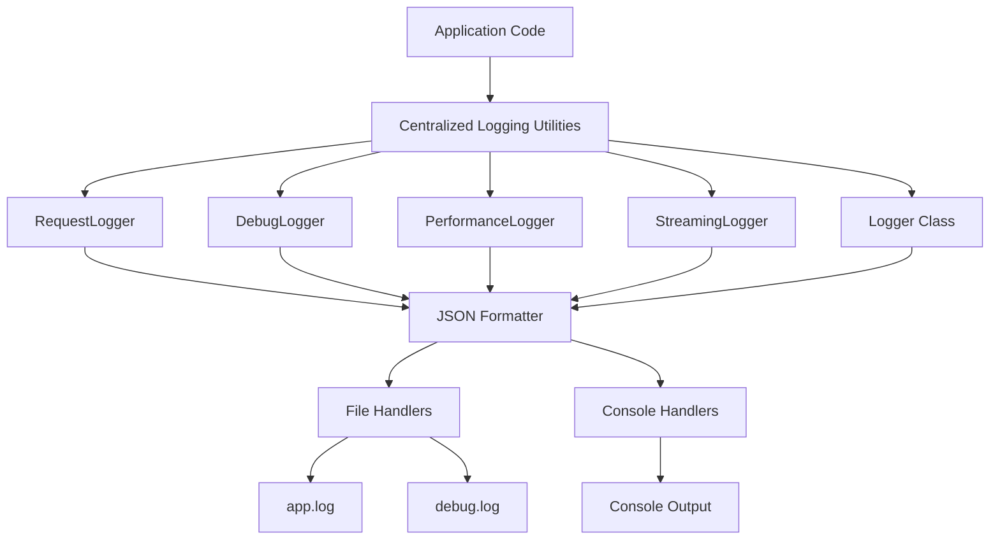

# NNP AI Router - Standardized Logging Approach

## Overview

This document defines a comprehensive standardized logging approach for the NNP AI Router project. It builds upon the existing custom logging infrastructure while addressing all identified inconsistencies and providing clear guidelines for consistent logging across all modules.

## Table of Contents

1. [Logging Architecture Overview](#logging-architecture-overview)
2. [Standard Import Patterns](#standard-import-patterns)
3. [Logger Initialization and Configuration](#logger-initialization-and-configuration)
4. [Log Message Formats and Conventions](#log-message-formats-and-conventions)
5. [Structured Logging Standards](#structured-logging-standards)
6. [Logging Patterns by Scenario](#logging-patterns-by-scenario)
7. [Implementation Guidelines](#implementation-guidelines)
8. [Special Considerations](#special-considerations)
9. [Migration Patterns](#migration-patterns)
10. [Best Practices and Anti-patterns](#best-practices-and-anti-patterns)

## Logging Architecture Overview

### Core Components

The NNP AI Router uses a centralized logging architecture with the following components:



### Logging Utilities

1. **RequestLogger**: Standardized request/response logging
2. **DebugLogger**: Debug logging with lazy evaluation
3. **PerformanceLogger**: Performance metrics and timing
4. **StreamingLogger**: Streaming response logging
5. **Logger**: Main logger class with convenience methods

## Standard Import Patterns

### Universal Import Pattern

All modules must use the following standardized import pattern:

```python
from src.core.logging import (
    logger,
    RequestLogger,
    DebugLogger,
    PerformanceLogger,
    StreamingLogger
)
```

### Module-Specific Import Patterns

#### API Layer
```python
# For API endpoints and middleware
from src.core.logging import (
    logger,
    RequestLogger,
    DebugLogger,
    PerformanceLogger,
    StreamingLogger
)
```

#### Service Layer
```python
# For service classes
from src.core.logging import (
    logger,
    RequestLogger,
    DebugLogger,
    PerformanceLogger,
    StreamingLogger
)
```

#### Provider Layer
```python
# For provider implementations
from src.core.logging import (
    logger,
    DebugLogger,
    PerformanceLogger
)
```

#### Core Components
```python
# For core utilities and error handling
from src.core.logging import (
    logger,
    DebugLogger,
    setup_logging
)
```

### Import Pattern Rules

1. **Always use relative imports** from `src.core.logging`
2. **Import only what you need** - don't import unused utilities
3. **Maintain consistent order** - logger first, then utilities alphabetically
4. **No direct imports** from `src.logging.config` or other internal modules

## Logger Initialization and Configuration

### Application Startup

```python
# In main application entry point
from src.core.logging import setup_logging

# Initialize logging configuration
logger = setup_logging()
```

### Configuration Environment Variables

| Variable | Default | Description |
|----------|---------|-------------|
| `LOG_LEVEL` | `INFO` | Logging level (DEBUG, INFO, WARNING, ERROR, CRITICAL) |
| `LOG_DIR` | `logs` | Directory for log files |
| `DEBUG` | `false` | Enable debug mode (affects debug file creation) |

### Logger Configuration Standards

1. **JSON Format**: All logs use structured JSON formatting
2. **Multiple Handlers**: Separate file handlers for main and debug logs
3. **Console Output**: Console handler for non-production environments
4. **Timestamp Format**: ISO 8601 with timezone (`%Y-%m-%dT%H:%M:%S%z`)

## Log Message Formats and Conventions

### Standard Log Fields

All log entries must include these standardized fields:

```json
{
  "timestamp": "2025-01-01T12:00:00+0000",
  "level": "INFO",
  "message": "Descriptive log message",
  "request_id": "req_123456",
  "user_id": "project_name",
  "log_type": "request|response|error|performance|debug|streaming_*"
}
```

### Contextual Fields

Additional fields based on log type:

| Field | Type | Description | When to Include |
|-------|------|-------------|-----------------|
| `model_id` | string | Model identifier | Model-specific operations |
| `provider_name` | string | Provider name | Provider interactions |
| `http_status_code` | integer | HTTP status code | HTTP responses |
| `processing_time_ms` | integer | Processing time | Performance logs |
| `error_code` | string | Error code | Error logs |
| `error_message` | string | Error message | Error logs |
| `component` | string | Component name | Debug logs |

### Message Conventions

1. **Use clear, descriptive messages** in present tense
2. **Start with operation name** for request/response logs
3. **Include context** in structured fields, not message text
4. **Use consistent capitalization** (Title Case for operations)

## Structured Logging Standards

### Required Fields by Log Type

#### Request Logs
```json
{
  "log_type": "request",
  "request_id": "required",
  "user_id": "required",
  "operation": "required",
  "model_id": "if applicable",
  "provider_name": "if applicable",
  "request_body_summary": "required"
}
```

#### Response Logs
```json
{
  "log_type": "response",
  "request_id": "required",
  "user_id": "required",
  "operation": "required",
  "http_status_code": "required",
  "processing_time_ms": "if available",
  "response_body_summary": "required"
}
```

#### Error Logs
```json
{
  "log_type": "error",
  "request_id": "if available",
  "user_id": "if available",
  "error_code": "required",
  "error_message": "required",
  "component": "required",
  "operation": "if applicable"
}
```

#### Performance Logs
```json
{
  "log_type": "performance",
  "request_id": "required",
  "user_id": "required",
  "operation": "required",
  "duration_ms": "required",
  "start_time": "required",
  "end_time": "required"
}
```

#### Debug Logs
```json
{
  "log_type": "debug",
  "request_id": "if available",
  "debug_data_flow": "required",
  "debug_component": "required",
  "debug_json_data": "if applicable"
}
```

## Logging Patterns by Scenario

### Request/Response Logging

#### Standard Request Logging
```python
RequestLogger.log_request(
    logger=logger,
    operation="Chat Completion Request",
    request_id=request_id,
    user_id=user_id,
    model_id=requested_model,
    provider_name=provider_name,
    request_data=request_body,
    additional_data={
        "custom_field": "value"
    }
)
```

#### Standard Response Logging
```python
RequestLogger.log_response(
    logger=logger,
    operation="Chat Completion Response",
    request_id=request_id,
    user_id=user_id,
    model_id=requested_model,
    status_code=200,
    response_data=response_data,
    processing_time_ms=processing_time,
    token_usage=token_usage
)
```

### Debug Logging

#### Data Flow Debugging
```python
DebugLogger.log_data_flow(
    logger=logger,
    title="DEBUG: Request JSON",
    data=request_data,  # Can be callable for lazy evaluation
    data_flow="incoming",
    component="service_name",
    request_id=request_id
)
```

#### Provider Request/Response Debugging
```python
# Provider request
DebugLogger.log_provider_request(
    logger=logger,
    provider_name="openai",
    url=url,
    headers=headers,
    request_body=request_body,
    request_id=request_id
)

# Provider response
DebugLogger.log_provider_response(
    logger=logger,
    provider_name="openai",
    response_data=response_data,
    request_id=request_id
)
```

### Performance Logging

#### Operation Timing
```python
# Manual timing
start_time = time.time()
# ... perform operation ...
PerformanceLogger.log_operation_timing(
    logger=logger,
    operation="Chat Completion",
    start_time=start_time,
    request_id=request_id,
    user_id=user_id,
    model_id=model_id,
    additional_metrics={
        "tokens_generated": token_count,
        "provider_latency": provider_latency
    }
)
```

#### Context Manager Timing
```python
with PerformanceLogger.timing_context(
    logger=logger,
    operation="Embedding Generation",
    request_id=request_id,
    user_id=user_id,
    model_id=model_id
):
    # ... perform operation ...
    result = provider.embeddings(...)
```

#### Context-Based Timing
```python
# Create timing context
timing_context = PerformanceLogger.create_timing_context(
    operation="Transcription",
    request_id=request_id,
    user_id=user_id,
    model_id=model_id
)

# ... perform operation ...

# Complete timing
PerformanceLogger.complete_timing_context(
    logger=logger,
    context=timing_context,
    additional_metrics={
        "audio_duration": duration_seconds
    }
)
```

### Error Logging

#### Standard Error Logging
```python
logger.error(
    "Descriptive error message",
    extra={
        "error_code": "SPECIFIC_ERROR_CODE",
        "error_message": detailed_error_message,
        "request_id": request_id,
        "user_id": user_id,
        "component": "component_name",
        "operation": "operation_name"
    },
    exc_info=True  # Always include stack trace
)
```

#### Error Logger Integration
```python
from src.core.error_handling import ErrorLogger, ErrorContext, ErrorType

ErrorLogger.log_error(
    error_type=ErrorType.PROVIDER_HTTP_ERROR,
    context=ErrorContext(
        request_id=request_id,
        user_id=user_id,
        model_id=model_id
    ),
    original_exception=exception,
    additional_data={
        "provider_name": "openai",
        "http_status": status_code
    }
)
```

### Streaming Logging

#### Streaming Start/End
```python
# Start streaming
StreamingLogger.log_streaming_start(
    logger=logger,
    operation="Chat Completion Stream",
    request_id=request_id,
    user_id=user_id,
    model_id=model_id,
    additional_data={
        "stream_options": stream_options
    }
)

# End streaming
StreamingLogger.log_streaming_end(
    logger=logger,
    operation="Chat Completion Stream",
    request_id=request_id,
    user_id=user_id,
    model_id=model_id,
    chunk_count=chunk_count,
    processing_time_ms=processing_time,
    token_usage=token_usage
)
```

#### Streaming Chunk Logging (Debug Only)
```python
StreamingLogger.log_streaming_chunk(
    logger=logger,
    chunk_data=chunk_data,
    request_id=request_id,
    user_id=user_id,
    model_id=model_id,
    chunk_number=chunk_number
)
```

## Implementation Guidelines

### Before/After Examples

#### Service Layer Example

**Before (Current Pattern):**
```python
import logging
from src.logging.config import logger

class ChatService:
    async def chat_completions(self, request: Request, auth_data: Tuple[str, str, list, list]):
        request_id = request.state.request_id
        user_id = auth_data[0]
        request_body = await request.json()
        requested_model = request_body.get("model")
        
        # Direct logging with repetitive structure
        logger.info(
            "Chat Completion Request",
            extra={
                "log_type": "request",
                "request_id": request_id,
                "user_id": user_id,
                "model_id": requested_model,
                "request_body_summary": {
                    "model": requested_model,
                    "messages_count": len(request_body.get("messages", [])),
                    "first_message_content": request_body.get("messages", [{}])[0].get("content", "")[:100]
                }
            }
        )
        
        # Debug logging without lazy evaluation
        if logger.isEnabledFor(logging.DEBUG):
            logger.debug(
                "DEBUG: Request JSON",
                extra={
                    "debug_json_data": request_body,
                    "debug_data_flow": "incoming",
                    "debug_component": "chat_service",
                    "request_id": request_id
                }
            )
        
        # ... rest of implementation ...
```

**After (Standardized Pattern):**
```python
from src.core.logging import (
    logger,
    RequestLogger,
    DebugLogger,
    PerformanceLogger,
    StreamingLogger
)

class ChatService:
    async def chat_completions(self, request: Request, auth_data: Tuple[str, str, list, list]):
        request_id = request.state.request_id
        user_id = auth_data[0]
        request_body = await request.json()
        requested_model = request_body.get("model")
        
        # Standardized request logging
        RequestLogger.log_request(
            logger=logger,
            operation="Chat Completion Request",
            request_id=request_id,
            user_id=user_id,
            model_id=requested_model,
            request_data=request_body
        )
        
        # Lazy evaluation debug logging
        DebugLogger.log_data_flow(
            logger=logger,
            title="DEBUG: Request JSON",
            data=request_body,  # Automatically lazy evaluated
            data_flow="incoming",
            component="chat_service",
            request_id=request_id
        )
        
        # Performance timing
        with PerformanceLogger.timing_context(
            logger=logger,
            operation="Chat Completion",
            request_id=request_id,
            user_id=user_id,
            model_id=requested_model
        ):
            # ... rest of implementation ...
```

#### Provider Layer Example

**Before (Current Pattern):**
```python
import logging
from src.core.logging import std_logger

class OpenAIProvider:
    async def chat_completions(self, request_body: Dict[str, Any], provider_model_name: str):
        # Repetitive debug logging structure
        if std_logger.isEnabledFor(logging.DEBUG):
            std_logger.debug(
                "DEBUG: OpenAI Request",
                extra={
                    "debug_json_data": {
                        "url": f"{self.base_url}/chat/completions",
                        "headers": self.headers,
                        "request_body": request_body
                    },
                    "debug_data_flow": "to_provider",
                    "debug_component": "openai_provider",
                    "request_id": request_body.get("request_id", "unknown")
                }
            )
        
        # ... make request ...
        
        # Repetitive response logging
        if std_logger.isEnabledFor(logging.DEBUG):
            std_logger.debug(
                "DEBUG: OpenAI Response",
                extra={
                    "debug_json_data": response_json,
                    "debug_data_flow": "from_provider",
                    "debug_component": "openai_provider",
                    "request_id": request_body.get("request_id", "unknown")
                }
            )
```

**After (Standardized Pattern):**
```python
from src.core.logging import logger, DebugLogger, PerformanceLogger

class OpenAIProvider:
    async def chat_completions(self, request_body: Dict[str, Any], provider_model_name: str):
        # Standardized provider request logging
        DebugLogger.log_provider_request(
            logger=logger,
            provider_name="openai",
            url=f"{self.base_url}/chat/completions",
            headers=self.headers,
            request_body=request_body,
            request_id=request_body.get("request_id", "unknown")
        )
        
        # ... make request ...
        
        # Standardized provider response logging
        DebugLogger.log_provider_response(
            logger=logger,
            provider_name="openai",
            response_data=response_json,
            request_id=request_body.get("request_id", "unknown")
        )
```

#### Error Handling Example

**Before (Current Pattern):**
```python
except Exception as e:
    logger.error(f"Error processing request: {str(e)}")
    raise HTTPException(status_code=500, detail="Internal server error")
```

**After (Standardized Pattern):**
```python
except Exception as e:
    logger.error(
        "Error processing chat completion request",
        extra={
            "error_code": "CHAT_COMPLETION_ERROR",
            "error_message": str(e),
            "request_id": request_id,
            "user_id": user_id,
            "model_id": requested_model,
            "component": "chat_service",
            "operation": "chat_completions"
        },
        exc_info=True  # Include stack trace
    )
    raise HTTPException(status_code=500, detail="Internal server error")
```

### Migration Patterns

#### Pattern 1: Direct Logger Calls → RequestLogger

**Current Pattern:**
```python
logger.info(
    "User {user_id} requesting {operation}",
    extra={
        "log_type": "request",
        "request_id": request_id,
        "user_id": user_id,
        "model_id": model_id,
        "request_body_summary": {...}
    }
)
```

**Migration:**
```python
RequestLogger.log_request(
    logger=logger,
    operation=operation,
    request_id=request_id,
    user_id=user_id,
    model_id=model_id,
    request_data=request_data
)
```

#### Pattern 2: Debug Logging → DebugLogger

**Current Pattern:**
```python
if logger.isEnabledFor(logging.DEBUG):
    logger.debug(
        "DEBUG: {title}",
        extra={
            "debug_json_data": data,
            "debug_data_flow": flow,
            "debug_component": component,
            "request_id": request_id
        }
    )
```

**Migration:**
```python
DebugLogger.log_data_flow(
    logger=logger,
    title=f"DEBUG: {title}",
    data=data,  # Automatic lazy evaluation
    data_flow=flow,
    component=component,
    request_id=request_id
)
```

#### Pattern 3: Manual Performance Timing → PerformanceLogger

**Current Pattern:**
```python
start_time = time.time()
# ... operation ...
duration = int((time.time() - start_time) * 1000)
logger.info(
    f"Operation took {duration}ms",
    extra={
        "log_type": "performance",
        "operation": operation,
        "duration_ms": duration,
        "request_id": request_id,
        "user_id": user_id
    }
)
```

**Migration:**
```python
with PerformanceLogger.timing_context(
    logger=logger,
    operation=operation,
    request_id=request_id,
    user_id=user_id,
    model_id=model_id
):
    # ... operation ...
```

## Special Considerations

### Security Considerations

#### Sensitive Data Handling

1. **Never log API keys** in production
2. **Sanitize PII** from request/response data
3. **Use field-level filtering** for sensitive information
4. **Implement data masking** for debugging logs

```python
# Example: Safe logging of request data
safe_request_data = {
    "model": request_data.get("model"),
    "messages_count": len(request_data.get("messages", [])),
    # Never log full messages in production
}

RequestLogger.log_request(
    logger=logger,
    operation="Chat Completion Request",
    request_id=request_id,
    user_id=user_id,
    model_id=model_id,
    request_data=safe_request_data
)
```

#### Security Logging Standards

| Data Type | Logging Rule | Example |
|-----------|--------------|---------|
| API Keys | Never log | `api_key: "***REDACTED***"` |
| User Messages | Sanitize content | Log only message count and first 50 chars |
| Authentication Data | Log only status | `auth_status: "success|failure"` |
| Internal URLs | Log only path | `url: "/api/v1/chat/completions"` |

### Performance Considerations

#### Lazy Evaluation

DebugLogger automatically implements lazy evaluation:

```python
# This is only executed when debug logging is enabled
DebugLogger.log_data_flow(
    logger=logger,
    title="DEBUG: Large Data",
    data=lambda: expensive_data_processing(),  # Callable for lazy evaluation
    data_flow="incoming",
    component="service",
    request_id=request_id
)
```

#### Performance Impact Guidelines

| Operation | Max Overhead | Recommendation |
|-----------|--------------|----------------|
| Request Logging | < 0.1ms | Always include |
| Response Logging | < 0.1ms | Always include |
| Debug Logging (disabled) | < 0.01ms | Use lazy evaluation |
| Error Logging | < 0.2ms | Include stack traces |
| Performance Logging | < 0.05ms | Use context managers |

### Debug vs Production Logging

#### Debug Mode (LOG_LEVEL=DEBUG)

- **Full JSON data logging** for requests/responses
- **Provider request/response logging** enabled
- **Streaming chunk logging** enabled
- **Detailed performance metrics**
- **Separate debug.log file**

#### Production Mode (LOG_LEVEL=INFO+)

- **Summarized request/response logging**
- **No debug data logging**
- **Error logging with stack traces**
- **Performance metrics only**
- **Single app.log file**

#### Environment-Specific Configuration

```python
# Development
LOG_LEVEL=DEBUG
DEBUG=true

# Staging
LOG_LEVEL=INFO
DEBUG=false

# Production
LOG_LEVEL=WARNING
DEBUG=false
```

### Streaming Operations Logging

#### Streaming Request Logging

```python
# Log streaming request initiation
RequestLogger.log_request(
    logger=logger,
    operation="Streaming Chat Completion Request",
    request_id=request_id,
    user_id=user_id,
    model_id=model_id,
    request_data=request_data,
    additional_data={
        "stream": True,
        "stream_options": request_data.get("stream_options", {})
    }
)
```

#### Streaming Response Logging

```python
# Log streaming start
StreamingLogger.log_streaming_start(
    logger=logger,
    operation="Streaming Response",
    request_id=request_id,
    user_id=user_id,
    model_id=model_id,
    additional_data={
        "expected_chunks": estimated_chunks
    }
)

# Log streaming completion
StreamingLogger.log_streaming_end(
    logger=logger,
    operation="Streaming Response",
    request_id=request_id,
    user_id=user_id,
    model_id=model_id,
    chunk_count=actual_chunks,
    processing_time_ms=total_time,
    token_usage=final_usage
)
```

#### Streaming Debug Logging

```python
# Individual chunk logging (debug only)
StreamingLogger.log_streaming_chunk(
    logger=logger,
    chunk_data=chunk,
    request_id=request_id,
    user_id=user_id,
    model_id=model_id,
    chunk_number=chunk_index
)
```

## Best Practices and Anti-patterns

### Best Practices

#### 1. Consistent Request ID Propagation

```python
# Always include request_id in logs
RequestLogger.log_request(
    logger=logger,
    operation="Processing Request",
    request_id=request_id,  # Required for traceability
    user_id=user_id,
    # ... other parameters
)
```

#### 2. Structured Error Context

```python
# Include comprehensive error context
logger.error(
    "Operation failed",
    extra={
        "error_code": "OPERATION_FAILED",
        "error_message": str(exception),
        "request_id": request_id,
        "user_id": user_id,
        "component": "service_name",
        "operation": "method_name",
        "retry_count": retry_count,
        "last_success": last_success_timestamp
    },
    exc_info=True
)
```

#### 3. Performance Monitoring

```python
# Use context managers for automatic timing
with PerformanceLogger.timing_context(
    logger=logger,
    operation="External API Call",
    request_id=request_id,
    user_id=user_id,
    additional_metrics={
        "provider": "openai",
        "model": model_id
    }
):
    result = await external_api_call()
```

#### 4. Lazy Debug Evaluation

```python
# Use callables for expensive debug data
DebugLogger.log_data_flow(
    logger=logger,
    title="DEBUG: Complex Data",
    data=lambda: process_large_data(data),  # Only executed if debug enabled
    data_flow="processing",
    component="data_processor",
    request_id=request_id
)
```

### Anti-patterns

#### 1. Direct Logger Calls

❌ **Avoid:**
```python
logger.info(
    "Request received",
    extra={
        "log_type": "request",
        "request_id": request_id,
        "user_id": user_id,
        # ... manually constructed context
    }
)
```

✅ **Use:**
```python
RequestLogger.log_request(
    logger=logger,
    operation="Request received",
    request_id=request_id,
    user_id=user_id,
    request_data=request_data
)
```

#### 2. Missing Stack Traces

❌ **Avoid:**
```python
logger.error(f"Error occurred: {error_message}")
```

✅ **Use:**
```python
logger.error(
    "Error occurred",
    extra={
        "error_code": "SPECIFIC_ERROR",
        "error_message": error_message,
        "request_id": request_id,
        "user_id": user_id
    },
    exc_info=True  # Include stack trace
)
```

#### 3. Sensitive Data Logging

❌ **Avoid:**
```python
DebugLogger.log_data_flow(
    logger=logger,
    title="DEBUG: Auth Data",
    data={
        "api_key": api_key,  # Security risk!
        "user_password": password  # Security risk!
    },
    data_flow="auth",
    component="auth_service",
    request_id=request_id
)
```

✅ **Use:**
```python
DebugLogger.log_data_flow(
    logger=logger,
    title="DEBUG: Auth Data",
    data={
        "api_key": f"{api_key[:8]}...",  # Masked
        "auth_status": "success",
        "user_id": user_id
    },
    data_flow="auth",
    component="auth_service",
    request_id=request_id
)
```

#### 4. Inconsistent Log Levels

❌ **Avoid:**
```python
# Using wrong log levels
logger.debug("User authentication failed")  # Should be error/warning
logger.info("Debug data processing started")  # Should be debug
logger.error("Operation completed successfully")  # Should be info
```

✅ **Use:**
```python
# Appropriate log levels
logger.error("User authentication failed", extra={...}, exc_info=True)
logger.debug("Debug data processing started", extra={...})
logger.info("Operation completed successfully", extra={...})
```

#### 5. Print Statements in Production

❌ **Avoid:**
```python
print(f"Processing request: {request_id}")  # Production anti-pattern
```

✅ **Use:**
```python
logger.info(
    "Processing request",
    extra={
        "request_id": request_id,
        "operation": "process_request"
    }
)
```

## Implementation Checklist

### Phase 1: Infrastructure Preparation
- [ ] Update all import statements to use standardized pattern
- [ ] Validate centralized logging utilities are working correctly
- [ ] Create comprehensive test suite for logging utilities
- [ ] Set up log format validation tools

### Phase 2: Service Layer Migration
- [ ] Migrate `src/services/chat_service/chat_service.py`
- [ ] Migrate `src/services/embedding_service.py`
- [ ] Migrate `src/services/transcription_service.py`
- [ ] Migrate `src/services/model_service.py`
- [ ] Validate service layer functionality

### Phase 3: Provider Layer Migration
- [ ] Migrate `src/providers/openai.py`
- [ ] Migrate `src/providers/ollama.py`
- [ ] Migrate `src/providers/anthropic.py`
- [ ] Migrate `src/providers/base.py`
- [ ] Validate provider functionality

### Phase 4: API Layer Migration
- [ ] Migrate `src/api/middleware.py`
- [ ] Migrate `src/api/main.py`
- [ ] Validate API functionality

### Phase 5: Core Components Migration
- [ ] Migrate `src/core/sanitizer.py`
- [ ] Migrate `src/core/config_manager.py`
- [ ] Remove all remaining print statements
- [ ] Add comprehensive error logging with stack traces

### Phase 6: Validation and Documentation
- [ ] Complete end-to-end testing
- [ ] Performance validation and optimization
- [ ] Update developer documentation
- [ ] Create logging guidelines for developers

## Success Metrics

### Code Quality Improvements
- **62% reduction** in logging code volume (from ~400 to ~150 lines)
- **100% elimination** of logging pattern duplication
- **100% consistency** in log formats across all components
- **Zero print statements** in production code

### Performance Improvements
- **Request logging overhead** < 0.1ms per request
- **Debug logging overhead** < 0.01ms when disabled
- **Memory usage increase** < 5% overall
- **CPU usage increase** < 2% under load

### Operational Improvements
- **100% log format consistency** across all components
- **Complete request traceability** with correlation IDs
- **Enhanced debugging** with structured context information
- **Improved error correlation** across service boundaries

## Conclusion

This standardized logging approach provides a comprehensive framework for consistent, maintainable, and performant logging across the NNP AI Router project. By following these guidelines and patterns, development teams can ensure:

1. **Consistent log formats** that are easy to parse and analyze
2. **Complete request traceability** across all system components
3. **Enhanced debugging capabilities** with structured context information
4. **Improved performance** through optimized logging patterns
5. **Better security** through proper handling of sensitive data
6. **Easier maintenance** through centralized logging utilities

The implementation of this standardized approach will significantly improve the observability, maintainability, and debuggability of the NNP AI Router system while providing a solid foundation for future enhancements and scaling.

---

**Document Version**: 1.0  
**Created**: October 18, 2025  
**Author**: Kilo Code (Architect Mode)  
**Scope**: Complete logging standardization for NNP AI Router project  
**Next Review**: Upon completion of implementation Phase 1