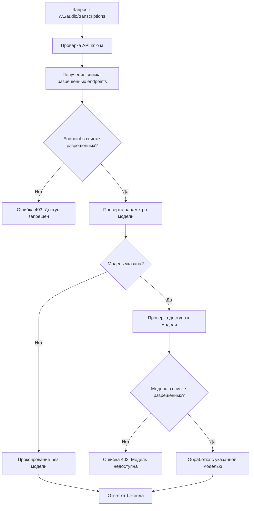

# Двухуровневая система контроля доступа для NNp LLM Router

## Обзор

Документ описывает архитектуру и реализацию двухуровневой системы контроля доступа для NNp LLM Router, которая обеспечивает гранулярный контроль доступа на уровне endpoints и моделей.

## Текущая архитектура

### Существующая система аутентификации

- Файл: [`src/core/auth.py`](src/core/auth.py)
- Функция: [`get_api_key()`](src/core/auth.py:7)
- Конфигурация: [`config/user_keys.yaml`](config/user_keys.yaml)
- Текущая проверка: только на уровне моделей

### Проблема

Для endpoint транскрипции (`/v1/audio/transcriptions`) необходимо сделать параметр модели необязательным, но при этом обеспечить безопасный доступ к самому endpoint.

## Предлагаемая архитектура

### 1. Структура конфигурации

Расширение файла [`config/user_keys.yaml`](config/user_keys.yaml) для поддержки доступа на уровне endpoints:

```yaml
user_keys:
  admin:
    api_key: admin-key-123
    allowed_models: []  # Доступ ко всем моделям
    allowed_endpoints: []  # Доступ ко всем endpoints
  developer:
    api_key: dev-key-456
    allowed_models:
      - openai/gpt-4
      - deepseek/chat
    allowed_endpoints:
      - /v1/chat/completions
      - /v1/audio/transcriptions
  transcription_user:
    api_key: trans-key-789
    allowed_models: []  # Может использовать любую модель
    allowed_endpoints:
      - /v1/audio/transcriptions  # Доступ только к транскрипции
```

### 2. Модификация системы аутентификации

В файле [`src/core/auth.py`](src/core/auth.py:41) нужно расширить функцию [`get_api_key()`](src/core/auth.py:7):

```python
async def get_api_key(
    request: Request,
    api_key: str = Security(api_key_header)
) -> Tuple[str, str, list, list]:  # Добавляем список разрешенных endpoints
    # ... текущая логика ...
    
    allowed_models = config["user_keys"][found_project].get("allowed_models", [])
    allowed_endpoints = config["user_keys"][found_project].get("allowed_endpoints", [])
    
    request.state.project_name = found_project
    return found_project, api_key, allowed_models, allowed_endpoints
```

### 3. Декоратор для проверки доступа к endpoints

Создать новый декоратор в [`src/core/auth.py`](src/core/auth.py):

```python
def check_endpoint_access(endpoint_path: str):
    async def endpoint_checker(
        request: Request,
        auth_data: tuple = Depends(get_api_key)
    ):
        _, _, _, allowed_endpoints = auth_data
        
        # Если список пуст, доступ разрешен ко всем endpoints
        if not allowed_endpoints or endpoint_path in allowed_endpoints:
            return auth_data
            
        raise HTTPException(
            status_code=status.HTTP_403_FORBIDDEN,
            detail={"error": {"message": f"Access to endpoint '{endpoint_path}' is not allowed", "code": "endpoint_not_allowed"}},
        )
    
    return endpoint_checker
```

### 4. Модификация TranscriptionService

В файле [`src/services/transcription_service.py`](src/services/transcription_service.py) нужно изменить метод [`create_transcription()`](src/services/transcription_service.py:77):

```python
async def create_transcription(
    self, 
    audio_file: UploadFile, 
    model_id: Optional[str] = None,  # Делаем модель необязательной
    auth_data: Tuple[str, str, Any, Any] = None,  # Обновляем тип
    response_format: str = "json", 
    temperature: float = 0.0, 
    language: str = None, 
    return_timestamps: bool = False
) -> Any:
    user_id, api_key, allowed_models, _ = auth_data
    
    # Если модель не указана, проксируем запрос как есть
    if not model_id:
        logger.info(f"User {user_id} requesting transcription without model specification")
        # Логика проксирования на бэкенд без указания модели
        return await self._proxy_transcription_request(
            audio_data=audio_data,
            filename=audio_file.filename,
            content_type=audio_file.content_type,
            auth_data=auth_data,
            response_format=response_format,
            temperature=temperature,
            language=language,
            return_timestamps=return_timestamps
        )
    
    # Если модель указана, проверяем права доступа
    if allowed_models and model_id not in allowed_models:
        raise HTTPException(
            status_code=status.HTTP_403_FORBIDDEN,
            detail={"error": {"message": f"Model '{model_id}' is not available for your account", "code": "model_not_allowed"}},
        )
    
    # Текущая логика с указанной моделью
    return await self._process_transcription_request(...)
```

### 5. Обновление API endpoints

В файле [`src/api/main.py`](src/api/main.py) нужно обновить endpoint транскрипции:

```python
@app.post("/v1/audio/transcriptions")
async def create_transcription(
    request: Request,
    audio_file: Optional[UploadFile] = File(None),
    file: Optional[UploadFile] = File(None),
    model: Optional[str] = Form(None),  # Делаем модель необязательной
    response_format: str = Form("json"),
    temperature: float = Form(0.0),
    language: Optional[str] = Form(None),
    return_timestamps: Optional[bool] = Form(False),
    auth_data: tuple = Depends(check_endpoint_access("/v1/audio/transcriptions"))  # Добавляем проверку доступа к endpoint
):
    # ... текущая логика ...
    
    return await app.state.transcription_service.create_transcription(
        uploaded_file, model, auth_data, response_format, temperature, language, return_timestamps
    )
```

## Диаграмма процесса проверки доступа



## Дополнительные соображения

### 1. Обработка других endpoints

Такую же логику нужно применить и к другим endpoints:

- `/v1/chat/completions` - модель обязательна
- `/v1/embeddings` - модель обязательна
- `/v1/models` - доступ к списку моделей
- `/v1/models/{model_id}` - доступ к информации о модели

### 2. Кэширование прав доступа

Для оптимизации производительности можно добавить кэширование прав доступа:

```python
# В auth.py
from functools import lru_cache
from typing import Dict, Tuple

@lru_cache(maxsize=128)
def get_cached_user_permissions(api_key: str) -> Tuple[str, list, list]:
    # Кэширование разрешений пользователя
    pass
```

### 3. Логирование доступа

Добавить детальное логирование для аудита:

```python
# В auth.py
logger.info(f"User {user_id} accessed {endpoint_path} with model {model_id or 'default'}")
```

### 4. Валидация конфигурации

Добавить валидацию конфигурации при запуске:

```python
# В config_manager.py
def validate_user_config(config: Dict[str, Any]) -> bool:
    # Проверка корректности конфигурации пользователей
    for user_name, user_data in config.get("user_keys", {}).items():
        if "api_key" not in user_data:
            raise ValueError(f"Missing api_key for user {user_name}")
        # Другие проверки...
```

### 5. Обработка ошибок

Стандартизировать обработку ошибок доступа:

```python
# В exceptions.py
class EndpointAccessDenied(HTTPException):
    def __init__(self, endpoint: str):
        super().__init__(
            status_code=status.HTTP_403_FORBIDDEN,
            detail={"error": {"message": f"Access to endpoint '{endpoint}' is not allowed", "code": "endpoint_not_allowed"}}
        )

class ModelAccessDenied(HTTPException):
    def __init__(self, model: str):
        super().__init__(
            status_code=status.HTTP_403_FORBIDDEN,
            detail={"error": {"message": f"Model '{model}' is not available for your account", "code": "model_not_allowed"}}
        )
```

### 6. Пример конфигурации для различных сценариев

```yaml
user_keys:
  # Администратор с полным доступом
  admin:
    api_key: admin-key-123
    allowed_models: []
    allowed_endpoints: []
  
  # Разработчик с доступом к чату и транскрипции
  developer:
    api_key: dev-key-456
    allowed_models:
      - openai/gpt-4
      - deepseek/chat
      - stt/dummy
    allowed_endpoints:
      - /v1/chat/completions
      - /v1/audio/transcriptions
  
  # Пользователь только для транскрипции с любой моделью
  transcription_user:
    api_key: trans-key-789
    allowed_models: []  # Любая модель
    allowed_endpoints:
      - /v1/audio/transcriptions  # Только транскрипция
  
  # Пользователь с доступом только к embedded
  embedding_user:
    api_key: embed-key-abc
    allowed_models:
      - embeddings/dummy
    allowed_endpoints:
      - /v1/embeddings
  
  # Пользователь только для чтения информации о моделях
  readonly_user:
    api_key: ro-key-def
    allowed_models: []  # Не имеет значения для чтения
    allowed_endpoints:
      - /v1/models
      - /v1/models/{model_id}
```

## Порядок внедрения

1. **Подготовка**: Создать резервные копии конфигурационных файлов
2. **Тестирование**: Развернуть тестовую среду для проверки изменений
3. **Миграция**: Постепенно обновлять конфигурацию пользователей
4. **Мониторинг**: Следить за логами доступа после внедрения

## Преимущества предложенного решения

1. **Гибкость**: Пользователи могут иметь доступ к конкретным endpoints независимо от моделей
2. **Обратная совместимость**: Существующая система прав на модели сохраняется
3. **Безопасность**: Двухуровневая проверка обеспечивает гранулярный контроль доступа
4. **Простота использования**: Для endpoints с необязательной моделью не нужно указывать модель
5. **Расширяемость**: Легко добавить новые endpoints и правила доступа

## Возможные проблемы и решения

**Проблема**: Обратная совместимость с существующими API ключами
**Решение**: Добавить значения по умолчанию для `allowed_endpoints` (пустой список = доступ ко всем)

**Проблема**: Сложность управления правами для большого количества пользователей
**Решение**: Рассмотреть возможность добавления ролей или групп пользователей в будущем

**Проблема**: Производительность при проверке прав для каждого запроса
**Решение**: Внедрить кэширование прав доступа и оптимизировать проверку

## План реализации

1. [x] Проанализировать текущую структуру конфигурации и аутентификации
2. [x] Спроектировать новую структуру конфигурации для контроля доступа на уровне endpoints
3. [ ] Модифицировать систему аутентификации для поддержки двухуровневой проверки прав
4. [ ] Обновить TranscriptionService для поддержки необязательного параметра модели
5. [ ] Изменить API endpoints для реализации новой логики проверки прав
6. [ ] Обновить конфигурационные файлы с новыми правилами доступа
7. [ ] Создать тесты для проверки новой функциональности
8. [ ] Обновить документацию

## Заключение

Предложенное решение обеспечивает требуемую функциональность с сохранением текущей архитектуры и добавлением нового уровня контроля доступа на уровне endpoints. Это позволяет сделать параметр модели необязательным для транскрипции при сохранении безопасности доступа.