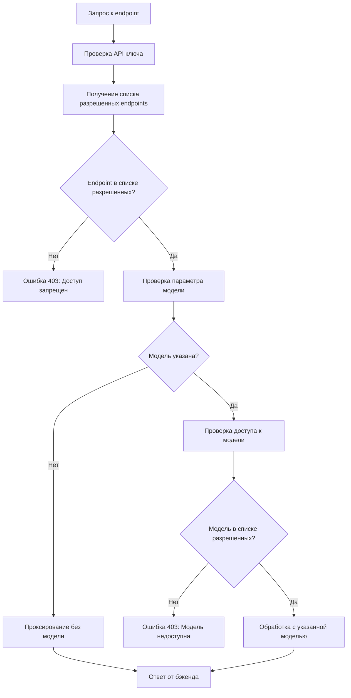

# Реализация двухуровневой системы контроля доступа

## Обзор

Документ описывает реализацию двухуровневой системы контроля доступа для NNp LLM Router, которая обеспечивает гранулярный контроль доступа на уровне endpoints и моделей.

## Изменения в коде

### 1. Модификация системы аутентификации (`src/core/auth.py`)

- Функция `get_api_key()` теперь возвращает кортеж из 4-х элементов:
  ```python
  return found_project, api_key, allowed_models, allowed_endpoints
  ```
- Добавлен декоратор `check_endpoint_access()` для проверки доступа к конкретным endpoints:
  ```python
  def check_endpoint_access(endpoint_path: str):
      async def endpoint_checker(request: Request, auth_data: tuple = Depends(get_api_key)):
          user_id, _, _, allowed_endpoints = auth_data
          if not allowed_endpoints or endpoint_path in allowed_endpoints:
              return auth_data
          raise HTTPException(status_code=status.HTTP_403_FORBIDDEN, ...)
      return endpoint_checker
  ```

### 2. Обновление API endpoints (`src/api/main.py`)

- Все endpoints теперь используют декоратор `check_endpoint_access()` для проверки доступа:
  ```python
  @app.post("/v1/audio/transcriptions")
  async def create_transcription(
      # ...
      auth_data: tuple = Depends(check_endpoint_access("/v1/audio/transcriptions"))
  ):
  ```
- Параметр `model` в endpoint транскрипции стал необязательным:
  ```python
  model: Optional[str] = Form(None),  # Делаем модель необязательной
  ```

### 3. Обновление TranscriptionService (`src/services/transcription_service.py`)

- Метод `create_transcription()` теперь поддерживает необязательный параметр `model_id`:
  ```python
  async def create_transcription(
      self, 
      audio_file: UploadFile, 
      model_id: Optional[str] = None,  # Делаем модель необязательной
      auth_data: Tuple[str, str, Any, Any] = None,
      # ...
  ):
  ```
- Добавлен метод `_proxy_transcription_request()` для обработки запросов без указания модели:
  ```python
  async def _proxy_transcription_request(
      self, audio_data: bytes, filename: str, content_type: str,
      auth_data: Tuple[str, str, Any, Any], **kwargs
  ):
      # Проксирует запрос на бэкенд без указания модели
      # Используем первую доступную модель для транскрипции
      current_config = self.config_manager.get_config()
      models = current_config.get("models", {})
      transcription_models = {k: v for k, v in models.items() if "transcriber" in v.get("provider", "")}
      default_model_id = list(transcription_models.keys())[0] if transcription_models else ""
      
      # Получаем конфигурацию модели по умолчанию
      model_config = transcription_models.get(default_model_id, {})
      provider_model_name = model_config.get("provider_model_name", default_model_id)
      
      response = await provider_instance.transcriptions(
          audio_data=audio_data,
          filename=filename,
          content_type=content_type,
          model_id=provider_model_name,  # Используем первую доступную модель
          api_key=api_key,
          base_url=provider_config.get("base_url"),
          response_format=response_format,
          temperature=temperature,
          return_timestamps=return_timestamps,
          language=language
      )
  ```

### 4. Обновление конфигурации (`config/user_keys.yaml`)

- Добавлено поле `allowed_endpoints` для каждого пользователя:
  ```yaml
  user_keys:
    transcription_user:
      api_key: trans-key-789
      allowed_models: []  # Может использовать любую модель
      allowed_endpoints:
        - /v1/audio/transcriptions  # Только транскрипция
  ```

## Примеры конфигураций

### 1. Администратор с полным доступом

```yaml
admin:
  api_key: admin-key-123
  allowed_models: []  # Доступ ко всем моделям
  allowed_endpoints: []  # Доступ ко всем endpoints
```

### 2. Пользователь только для транскрипции

```yaml
transcription_user:
  api_key: trans-key-789
  allowed_models: []  # Может использовать любую модель
  allowed_endpoints:
    - /v1/audio/transcriptions  # Только транскрипция
```

### 3. Разработчик с доступом к чату и транскрипции

```yaml
developer:
  api_key: dev-key-456
  allowed_models:
    - openai/gpt-4
    - deepseek/chat
    - stt/dummy
  allowed_endpoints:
    - /v1/chat/completions
    - /v1/audio/transcriptions
```

### 4. Пользователь с доступом только к embedded

```yaml
embedding_user:
  api_key: embed-key-abc
  allowed_models:
    - embeddings/dummy
  allowed_endpoints:
    - /v1/embeddings
```

### 5. Пользователь только для чтения информации о моделях

```yaml
readonly_user:
  api_key: ro-key-def
  allowed_models: []  # Не имеет значения для чтения
  allowed_endpoints:
    - /v1/models
    - /v1/models/{model_id}
```

## Процесс проверки доступа



## Тестирование

Создан тестовый файл `tests/test_two_level_access_control.py` для проверки новой функциональности:

- Тесты доступа к endpoints для различных типов пользователей
- Тесты доступа к моделям
- Тесты транскрипции без указания модели
- Тесты обработки неверных API ключей

### Запуск тестов

```bash
cd /path/to/nnp-llm-router
python -m pytest tests/test_two_level_access_control.py -v
```

## Обратная совместимость

- Существующие API ключи продолжают работать
- Если поле `allowed_endpoints` не указано или пусто, пользователь имеет доступ ко всем endpoints
- Если поле `allowed_models` не указано или пусто, пользователь имеет доступ ко всем моделям

## Использование

### 1. Транскрипция без указания модели

```bash
curl -X POST "http://localhost:8777/v1/audio/transcriptions" \
  -H "Authorization: Bearer trans-key-789" \
  -F "file=@audio.ogg"
```

### 2. Транскрипция с указанием модели

```bash
curl -X POST "http://localhost:8777/v1/audio/transcriptions" \
  -H "Authorization: Bearer dev-key-456" \
  -F "file=@audio.ogg" \
  -F "model=stt/dummy"
```

### 3. Чат с указанием модели

```bash
curl -X POST "http://localhost:8777/v1/chat/completions" \
  -H "Authorization: Bearer dev-key-456" \
  -H "Content-Type: application/json" \
  -d '{
    "model": "deepseek/chat",
    "messages": [{"role": "user", "content": "Hello"}]
  }'
```

## Обработка ошибок

### 1. Доступ к endpoint запрещен

```json
{
  "error": {
    "message": "Access to endpoint '/v1/chat/completions' is not allowed",
    "code": "endpoint_not_allowed"
  }
}
```

### 2. Доступ к модели запрещен

```json
{
  "error": {
    "message": "Model 'gemini/pro' is not available for your account",
    "code": "model_not_allowed"
  }
}
```

### 3. Неверный API ключ

```json
{
  "error": {
    "message": "Invalid API key",
    "code": "invalid_api_key"
  }
}
```

## Логирование

Добавлено детальное логирование для аудита доступа:

```python
logger.info(f"User {user_id} accessed {endpoint_path} with model {model_id or 'default'}")
logger.error(f"User {user_id} denied access to endpoint {endpoint_path}")
logger.error(f"User {user_id} denied access to model {model_id}")
```

## Будущие улучшения

1. **Кэширование прав доступа** для оптимизации производительности
2. **Роли и группы пользователей** для упрощения управления
3. **Временные ограничения доступа** для API ключей
4. **Детальная статистика использования** по пользователям и моделям
5. **Динамическое обновление прав** без перезагрузки сервиса

## Заключение

Реализованная двухуровневая система контроля доступа обеспечивает гибкий и безопасный механизм управления доступом к API NNp LLM Router. Она позволяет гранулярно настраивать права доступа как на уровне endpoints, так и на уровне моделей, сохраняя при этом обратную совместимость с существующими API ключами.