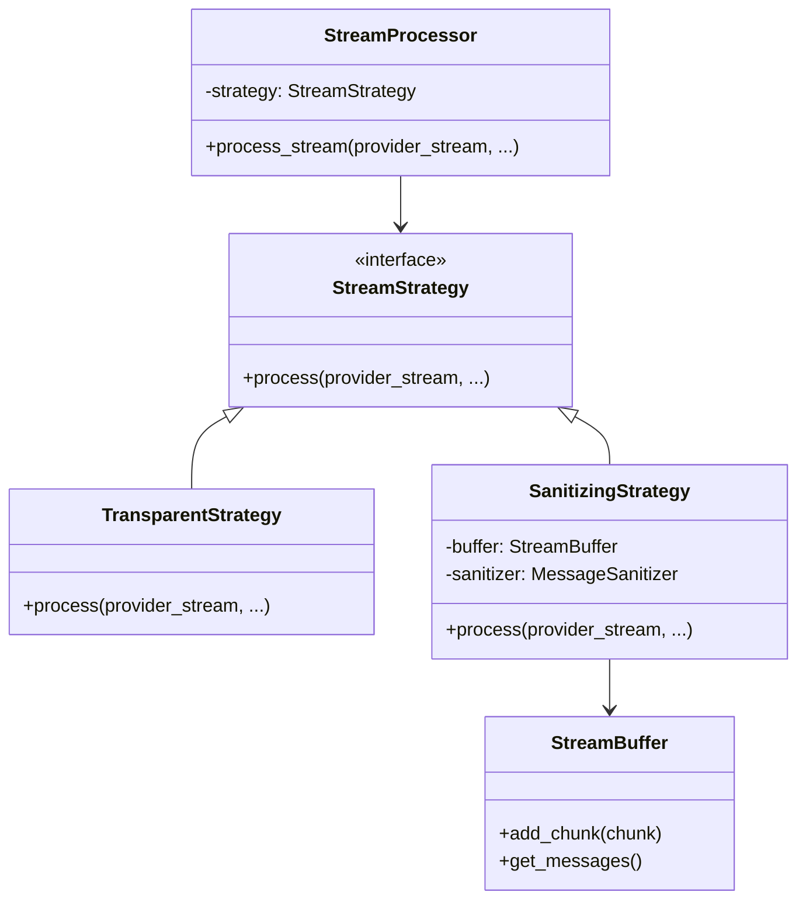
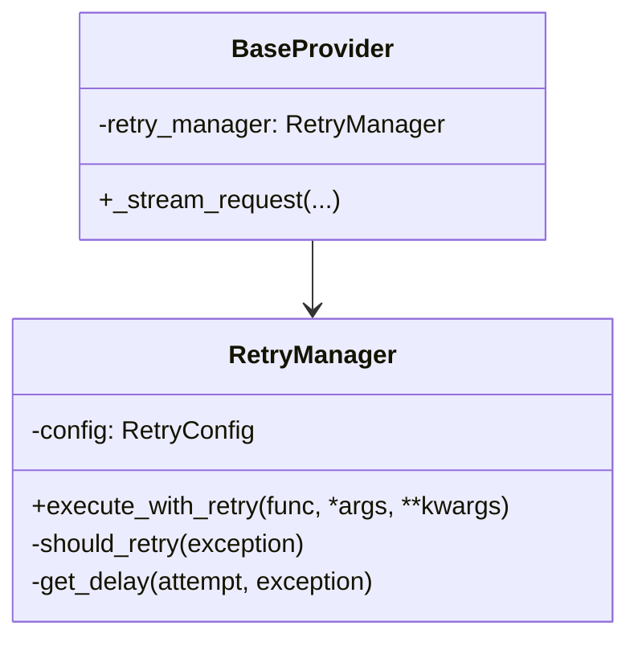
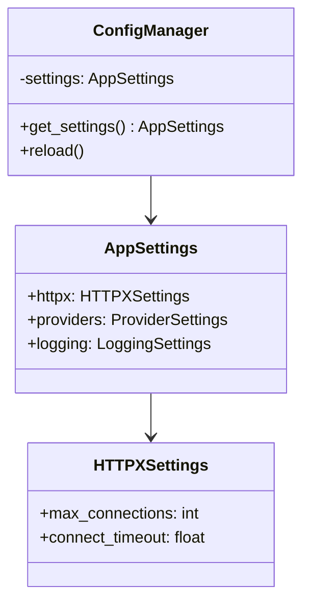

# Architecture Refactoring Plan

This document outlines the design for architecture improvements in the `nnp-ai-router` project, focusing on maintainability, redundancy reduction, and improved configuration management.

## 1. StreamProcessor Refactoring (Strategy Pattern)

### Current Issues
- High complexity (17k+ chars)
- Mixed responsibilities (SSE parsing, buffering, sanitization, error formatting)
- Deeply nested conditional logic for transparent vs. sanitization modes
- Duplicate logic paths

### Proposed Design
We will use the **Strategy Pattern** to separate the processing logic for different modes.



### Key Components
1.  **`StreamStrategy` (Interface)**: Defines the `process` method for handling the stream.
2.  **`TransparentStrategy`**: Implements minimal overhead forwarding.
3.  **`SanitizingStrategy`**: Implements SSE parsing, buffering, and sanitization.
4.  **`StreamBuffer`**: Extracted logic for handling partial SSE messages and UTF-8 decoding.

### Code Example (Conceptual)
```python
class StreamStrategy(ABC):
    @abstractmethod
    async def process(self, provider_stream, context):
        pass

class TransparentStrategy(StreamStrategy):
    async def process(self, provider_stream, context):
        async for chunk in provider_stream:
            # Minimal logging and yielding
            yield chunk

class SanitizingStrategy(StreamStrategy):
    def __init__(self, sanitizer):
        self.buffer = StreamBuffer()
        self.sanitizer = sanitizer

    async def process(self, provider_stream, context):
        async for chunk in provider_stream:
            messages = self.buffer.add_chunk(chunk)
            for msg in messages:
                sanitized = self.sanitizer.sanitize(msg)
                yield sanitized
```

---

## 2. RetryManager Extraction

### Current Issues
- `BaseProvider` is bloated with retry logic
- Complex decorator with nested conditionals
- Tight coupling with `ConfigManager` inside the decorator

### Proposed Design
Extract retry logic into a dedicated `RetryManager` class.



### Key Components
1.  **`RetryManager`**: Handles the retry loop, exponential backoff, and `Retry-After` header parsing.
2.  **`RetryConfig`**: Data class for retry settings (max retries, base delay, etc.).

### Code Example (Conceptual)
```python
class RetryManager:
    def __init__(self, config: RetryConfig):
        self.config = config

    async def execute_with_retry(self, func, *args, **kwargs):
        for attempt in range(self.config.max_retries + 1):
            try:
                return await func(*args, **kwargs)
            except Exception as e:
                if not self._should_retry(e) or attempt == self.config.max_retries:
                    raise
                delay = self._get_delay(attempt, e)
                await asyncio.sleep(delay)
```

---

## 3. ConfigManager Refactoring (Configuration Schema)

### Current Issues
- Property explosion (15+ individual properties)
- Scattered environment variable access
- Mixed concerns (loading, validation, access)

### Proposed Design
Use **Pydantic** to define a structured configuration schema.



### Key Components
1.  **`AppSettings` (Pydantic Model)**: Centralized schema with validation and default values.
2.  **`ConfigManager`**: Responsible for loading YAML files and environment variables into the `AppSettings` model.

### Code Example (Conceptual)
```python
class HTTPXSettings(BaseModel):
    max_connections: int = Field(default=100, env="HTTPX_MAX_CONNECTIONS")
    connect_timeout: float = Field(default=60.0, env="HTTPX_CONNECT_TIMEOUT")

class AppSettings(BaseSettings):
    httpx: HTTPXSettings = HTTPXSettings()
    # ... other settings
```

---

## Implementation Steps

1.  **Phase 1: ConfigManager**
    - Define Pydantic models in `src/core/config_schema.py`.
    - Update `ConfigManager` to use the schema.
    - Maintain backward compatibility by keeping existing properties as proxies to the schema (deprecated).

2.  **Phase 2: RetryManager**
    - Create `src/core/retry_manager.py`.
    - Move logic from `src/providers/base.py` to `RetryManager`.
    - Update `BaseProvider` to use `RetryManager`.

3.  **Phase 3: StreamProcessor**
    - Create `src/services/chat_service/strategies/`.
    - Implement `StreamBuffer` and strategies.
    - Refactor `StreamProcessor` to delegate to strategies.

## Risk Mitigation
- **Incremental Changes**: Refactor one component at a time.
- **Backward Compatibility**: Keep existing interfaces where possible during transition.
- **Comprehensive Logging**: Ensure all existing log points are preserved in the new structure.

## Testing Strategy
- **Unit Tests**: For `StreamBuffer`, `RetryManager`, and `ConfigSchema`.
- **Integration Tests**: Verify `StreamProcessor` with both strategies using mock provider streams.
- **Regression Tests**: Run existing API tests to ensure no breakage in provider communication.

## Documentation Requirements
- Update docstrings for all new classes and methods.
- Add architecture overview to `docs/`.
- Document configuration schema in `README.md`.
