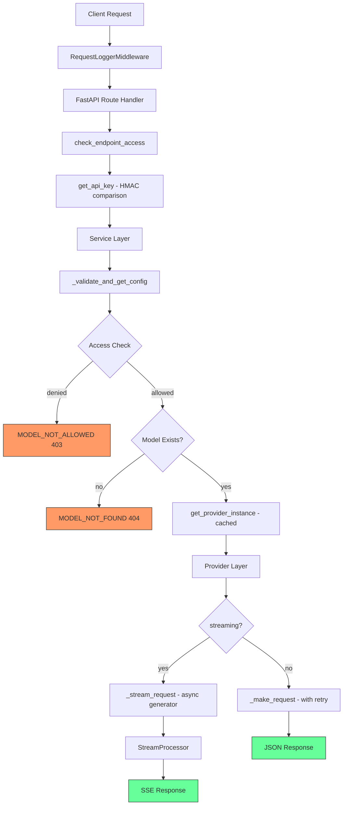

# Code Review: NNP AI Router

**Date**: 2026-03-30  
**Reviewer**: Architect Mode  
**Scope**: Full codebase review — architecture, security, error handling, code quality, testing

---

## Summary

NNP AI Router is a well-structured OpenAI-compatible API gateway with clean separation of concerns. The codebase follows its own RULES.md consistently, has good test coverage, and demonstrates thoughtful architectural decisions. However, there are several issues ranging from critical security concerns to minor code quality improvements.

**Overall Assessment: 7.5/10** — Solid foundation with notable security and robustness gaps.

---

## 1. Critical Issues

### 1.1 🔴 API Keys Logged in Plaintext

**File**: [`src/api/main.py`](src/api/main.py:190)

```python
key = generate_key()
logger.debug_data(
    title="Generated API Key",
    data={"key": key},
    request_id=request_id
)
```

Generated API keys are logged in plaintext to debug logs. If debug logs are persisted or shared, this exposes credentials.

**Recommendation**: Never log full API keys. Log only a prefix/mask: `nnp-v1-abc1...`.

### 1.2 🔴 No Rate Limiting on Key Generation Endpoint

**File**: [`src/api/main.py`](src/api/main.py:170)

The `/tools/generate_key` endpoint has no rate limiting. An attacker could generate unlimited API keys.

**Recommendation**: Add rate limiting middleware or per-IP throttling on this endpoint. Consider requiring admin-level authentication.

### 1.3 🔴 No Input Validation on Request Body Size

**Files**: [`src/services/chat_service/chat_service.py`](src/services/chat_service/chat_service.py:34), [`src/services/embedding_service.py`](src/services/embedding_service.py:28)

`await request.json()` has no size limit. An attacker could send a multi-GB JSON payload to exhaust memory.

**Recommendation**: Configure FastAPI/Uvicorn request body size limits, or validate `Content-Length` before parsing.

### 1.4 🔴 Transcription Service — No File Size Limit

**File**: [`src/services/transcription_service.py`](src/services/transcription_service.py:39)

```python
audio_data = await audio_file.read()
```

The entire audio file is read into memory with no size check. A large upload could OOM the service.

**Recommendation**: Check `Content-Length` or `UploadFile.size` before reading. Set a max file size constant.

---

## 2. Security Issues

### 2.1 🟠 Weak API Keys in Configuration

**File**: [`config/user_keys.yaml`](config/user_keys.yaml)

```yaml
debug:
  api_key: dummy
limited:
  api_key: limited
transctiber:
  api_key: transctiber
```

These are trivially guessable keys. While this may be intentional for development, there is no warning or mechanism to prevent these from reaching production.

**Recommendation**: Add startup validation that rejects keys shorter than a minimum length in production mode, or add a `--allow-weak-keys` dev flag.

### 2.2 🟠 Bearer Token Parsing Accepts Raw Tokens

**File**: [`src/core/auth.py`](src/core/auth.py:41)

```python
if api_key.startswith("Bearer "):
    api_key = api_key[len("Bearer "):]
```

The `APIKeyHeader` with `name="Authorization"` returns the full header value. The code strips `Bearer ` prefix, but `APIKeyHeader` is designed for raw API keys, not the Authorization header. This creates ambiguity — a key literally starting with "Bearer " would be silently truncated.

**Recommendation**: Use `HTTPBearer` security scheme instead, or use `APIKeyHeader(name="X-API-Key")` for a custom header. The current approach conflates two auth patterns.

### 2.3 🟠 No HTTPS Enforcement

**File**: [`src/api/main.py`](src/api/main.py:200)

Uvicorn runs on plain HTTP. In production, HTTPS should be enforced.

**Recommendation**: Document that a reverse proxy (nginx/Caddy) must handle TLS termination, or add middleware that rejects non-TLS requests in production.

### 2.4 🟡 Provider API Keys Exposed via Provider Cache

**File**: [`src/providers/base.py`](src/providers/base.py:109)

API keys are stored in `self.headers["Authorization"]` on cached provider instances. If any debugging/serialization exposes provider state, keys leak.

**Recommendation**: Mark headers as sensitive in logging. The `_log_provider_data` method already logs headers — ensure `Authorization` is masked.

---

## 3. Architecture Issues

### 3.1 🟠 `BaseHTTPMiddleware` Known Performance Issues

**File**: [`src/api/middleware.py`](src/api/middleware.py:11)

Starlette's `BaseHTTPMiddleware` has documented issues with streaming responses — it can buffer the entire response body, defeating the purpose of streaming.

**Recommendation**: Convert to a pure ASGI middleware or use FastAPI's `@app.middleware("http")` with manual `receive`/`send` wrapping. This is especially critical since the project's core feature is SSE streaming.

### 3.2 🟠 Module-Level Logger Singleton Side Effects

**File**: [`src/core/logging/__init__.py`](src/core/logging/__init__.py:19)

```python
logger = get_logger()
```

The logger is instantiated at import time, which means `setup_logging()` runs before the application configures `LOG_LEVEL`. The `Logger.__init__` in [`src/core/logging/logger.py`](src/core/logging/logger.py:143) also creates a second instance:

```python
# Create default logger instance
logger = Logger()
```

There are **two** competing singleton patterns — one in `__init__.py` and one at the bottom of `logger.py`.

**Recommendation**: Remove the duplicate in `logger.py`. Use a single initialization point.

### 3.3 🟠 `ModelService` Does Not Inherit from `BaseService`

**File**: [`src/services/model_service.py`](src/services/model_service.py:13)

```python
class ModelService:
    def __init__(self, config_manager: ConfigManager, httpx_client: httpx.AsyncClient):
```

Unlike `ChatService`, `EmbeddingService`, and `TranscriptionService`, `ModelService` does not extend `BaseService`. This breaks the pattern established by other services.

**Recommendation**: Have `ModelService` extend `BaseService` for consistency, or document why it is intentionally different.

### 3.4 🟡 `TranscriptionService` Does Not Pass `request_id`

**File**: [`src/services/transcription_service.py`](src/services/transcription_service.py:54)

```python
request_id="unknown"
```

The `request_id` is hardcoded as `"unknown"` in multiple log calls. The `request_id` is available from the middleware but not passed through the transcription endpoint.

**Recommendation**: Pass `request_id` from the route handler through to the service.

### 3.5 🟡 `stream_format` Config Field Unused

**File**: [`config/providers.yaml`](config/providers.yaml:6)

Every provider has `stream_format: sse` or `stream_format: ndjson`, but this field is never read anywhere in the codebase. The `StreamProcessor` always assumes SSE format.

**Recommendation**: Either implement `ndjson` support in `StreamProcessor` or remove the field from config to avoid confusion.

---

## 4. Code Quality Issues

### 4.1 🟠 Inconsistent Error Handling in `_stream_request`

**File**: [`src/providers/base.py`](src/providers/base.py:338)

```python
try:
    response.raise_for_status()
except httpx.HTTPStatusError as e:
    self._raise_provider_http_error(e, request_id)
except httpx.PoolTimeout as e:
    ...
except httpx.RequestError as e:
    ...
```

`_raise_provider_http_error` raises an exception, but the `except` blocks after it can never catch anything from the `raise_for_status()` call because `HTTPStatusError` is a subclass of `RequestError`. The `PoolTimeout` catch is unreachable in this position — `raise_for_status()` does not raise `PoolTimeout`.

**Recommendation**: Move `PoolTimeout` handling to the outer `client.stream()` call context where it can actually occur.

### 4.2 🟡 Shallow Copy in Sanitizer

**File**: [`src/core/sanitizer.py`](src/core/sanitizer.py:25)

```python
clean_message = message.copy()
```

This is a shallow copy. Nested dicts/lists in messages are shared references. Mutations to nested structures would affect the original.

**Recommendation**: Use `copy.deepcopy()` or at minimum document that shallow copy is intentional for performance.

### 4.3 🟡 Redundant `error_detail["error"]["code"]` Assignment

**File**: [`src/core/error_handling/error_handler.py`](src/core/error_handling/error_handler.py:24)

```python
error_detail = error_type.create_error_detail(**context)
error_detail["error"]["code"] = error_type.status_code
```

`create_error_detail` already sets `code` to `status_code`. This line overwrites it with the same value.

**Recommendation**: Remove the redundant assignment.

### 4.4 🟡 `yaml.safe_load` Result Not Checked for `None`

**File**: [`src/core/config_manager.py`](src/core/config_manager.py:47)

```python
config[key] = yaml.safe_load(f).get(key, {})
```

If a YAML file is empty, `yaml.safe_load()` returns `None`, and `.get(key, {})` would raise `AttributeError`.

**Recommendation**: Add a `None` check: `(yaml.safe_load(f) or {}).get(key, {})`.

### 4.5 🟡 Typo in Config Key Name

**File**: [`config/user_keys.yaml`](config/user_keys.yaml:10)

```yaml
transctiber:
```

Should be `transcriber`. This typo propagates to test fixtures in [`tests/conftest.py`](tests/conftest.py:26).

**Recommendation**: Fix the typo in both config and tests.

### 4.6 🟡 Mixed Logging Styles

Throughout the codebase, two logging styles are used interchangeably:

1. Keyword args: `logger.info("msg", request_id=id, user_id=uid)`
2. Extra dict: `logger.info("msg", extra={"request_id": id})`

**Files**: [`src/api/main.py`](src/api/main.py:123) vs [`src/api/middleware.py`](src/api/middleware.py:22)

**Recommendation**: Standardize on one style. The `Logger` class supports both via `_process_kwargs`, but consistency improves readability.

### 4.7 🟡 `from fastapi import HTTPException` Inside Method

**File**: [`src/providers/base.py`](src/providers/base.py:155)

```python
def _raise_provider_http_error(self, e, request_id="unknown"):
    from fastapi import HTTPException
```

Local import inside a method that runs on every error. This is a minor performance issue and breaks the convention of top-level imports.

**Recommendation**: Move to module-level import.

---

## 5. Testing Observations

### 5.1 ✅ Good Coverage

- 158 unit tests + 114 integration tests = comprehensive coverage
- Unit tests cover all major components: stream processing, providers, config, sanitization, error handling
- Integration tests cover all API endpoints

### 5.2 🟡 Test Fixture Installs Functions on `pytest` Module

**File**: [`tests/conftest.py`](tests/conftest.py:295)

```python
pytest.assert_valid_response_structure = assert_valid_response_structure
```

Monkey-patching the `pytest` module is an anti-pattern. These should be regular imports or pytest plugins.

**Recommendation**: Move assertion helpers to a `tests/helpers.py` module and import them explicitly.

### 5.3 🟡 Bare `except` in Test Fixture

**File**: [`tests/conftest.py`](tests/conftest.py:254)

```python
except:
    return False
```

Bare `except` catches everything including `KeyboardInterrupt` and `SystemExit`.

**Recommendation**: Use `except Exception`.

---

## 6. Infrastructure & Deployment

### 6.1 🟠 Docker Compose Mounts Source as Volume

**File**: [`docker-compose.yml`](docker-compose.yml:7)

```yaml
volumes:
  - ./src:/app/src
```

This mounts source code into the container, overriding the `COPY . .` in the Dockerfile. While useful for development, this should not be used in production.

**Recommendation**: Use separate docker-compose files for dev and prod, or use profiles.

### 6.2 🟡 No Health Check in Docker Compose

**File**: [`docker-compose.yml`](docker-compose.yml)

No `healthcheck` directive. Docker cannot determine if the service is actually healthy.

**Recommendation**: Add:
```yaml
healthcheck:
  test: ["CMD", "curl", "-f", "http://localhost:8000/health"]
  interval: 30s
  timeout: 10s
  retries: 3
```

### 6.3 🟡 No `.env.example` File

The README references `.env.example` but the file does not exist in the repository.

**Recommendation**: Create `.env.example` with all required environment variables and placeholder values.

---

## 7. Positive Observations

These are things the project does well:

1. **Clean layered architecture**: API → Service → Provider with clear responsibilities
2. **Security-first access control**: Access check before existence check prevents info leakage
3. **Constant-time key comparison**: `hmac.compare_digest` for API key validation
4. **Hot-reload config**: No restart needed for config changes
5. **Provider caching**: Smart caching by `(type, base_url)` with cache invalidation on reload
6. **Comprehensive error types**: `ErrorType` enum with structured error format
7. **UTF-8 split recovery**: Handles multi-byte character splits at chunk boundaries
8. **Architectural annotations**: `# ARCH:` and `# INVARIANT:` comments document decisions
9. **Module docstrings**: Every file has a clear module-level docstring
10. **Exponential backoff retry**: Properly implemented with configurable parameters

---

## 8. Priority Recommendations

| Priority | Issue | Effort |
|----------|-------|--------|
| P0 | Add request body size limits | Small |
| P0 | Add file upload size limits | Small |
| P0 | Mask API keys in logs | Small |
| P1 | Replace `BaseHTTPMiddleware` with pure ASGI | Medium |
| P1 | Add rate limiting on `/tools/generate_key` | Medium |
| P1 | Fix `yaml.safe_load` None handling | Small |
| P1 | Fix unreachable exception handlers in `_stream_request` | Small |
| P2 | Standardize logging style | Medium |
| P2 | Fix duplicate logger singleton | Small |
| P2 | Make `ModelService` extend `BaseService` | Small |
| P2 | Create `.env.example` | Small |
| P2 | Add Docker health check | Small |
| P3 | Remove unused `stream_format` config field | Small |
| P3 | Fix `transctiber` typo | Small |
| P3 | Move assertion helpers out of pytest module | Small |

---

## 9. Architecture Diagram


