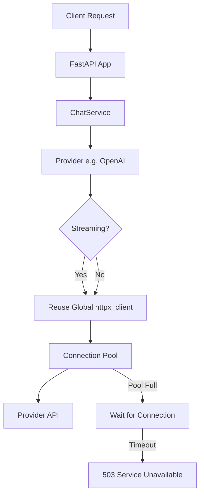

# Architectural Plan: Optimizing Parallel Request Processing

This plan outlines the changes required to optimize connection handling and parallel request processing in the NNP AI Router.

## 1. Objectives
- Reuse `httpx.AsyncClient` for all requests, including streaming.
- Implement connection pool limits to prevent resource exhaustion and provider errors.
- Provide configurable parameters for fine-tuning performance.
- Improve error handling for connection pool exhaustion.

## 2. Proposed Changes

### 2.1. Configuration (`src/core/config_manager.py`)
Add new configuration parameters to `ConfigManager` to allow tuning the connection pool via environment variables.

**New Properties:**
- `httpx_max_connections`: Maximum number of concurrent connections (default: 100).
- `httpx_max_keepalive_connections`: Maximum number of keep-alive connections (default: 20).
- `httpx_pool_timeout`: Timeout for acquiring a connection from the pool (default: 60.0s).

**Logic:**
Read these values from environment variables:
- `HTTPX_MAX_CONNECTIONS`
- `HTTPX_MAX_KEEPALIVE_CONNECTIONS`
- `HTTPX_POOL_TIMEOUT`

### 2.2. Global Client Initialization (`src/api/main.py`)
Update the `startup_event` to initialize the global `httpx.AsyncClient` with explicit limits and timeouts.

**Changes:**
- Create `httpx.Limits` using values from `config_manager`.
- Update `httpx.AsyncClient` instantiation to use these limits.
- Set the `pool` timeout in `httpx.Timeout`.

```python
# Pseudocode for src/api/main.py
@app.on_event("startup")
async def startup_event():
    # ...
    limits = httpx.Limits(
        max_connections=config_manager.httpx_max_connections,
        max_keepalive_connections=config_manager.httpx_max_keepalive_connections
    )
    app.state.httpx_client = httpx.AsyncClient(
        limits=limits,
        timeout=httpx.Timeout(
            connect=60.0,
            read=None,
            write=None,
            pool=config_manager.httpx_pool_timeout
        )
    )
```

### 2.3. Streaming Request Optimization (`src/providers/base.py`)
Refactor `_stream_request` to reuse the existing client instead of creating a new one for every request.

**Changes:**
- Remove the `async with httpx.AsyncClient(...) as stream_client:` block inside the `generate` generator.
- Use the `client` passed as an argument to `_stream_request`.
- Pass `timeout=stream_timeout` directly to `client.stream()`.
- Adjust `stream_timeout` to inherit the pool timeout from the client or use a sensible default.

```python
# Pseudocode for src/providers/base.py
async def _stream_request(self, client: httpx.AsyncClient, url_path: str, request_body: Dict[str, Any]):
    # ...
    stream_timeout = httpx.Timeout(
        connect=60.0,
        read=None,
        write=None,
        pool=client.timeout.pool
    )
    
    async def generate():
        try:
            async with client.stream("POST", url, json=request_body, timeout=stream_timeout) as response:
                # ... yield chunks ...
        except httpx.PoolTimeout as e:
            # Handle pool exhaustion
            raise ErrorHandler.handle_service_unavailable(
                error_details="Connection pool exhausted",
                context=context,
                original_exception=e
            )
```

### 2.4. Error Handling (`src/core/error_handling/error_handler.py`)
Ensure `httpx.PoolTimeout` is handled gracefully.

**Changes:**
- If not already covered, ensure `handle_service_unavailable` or a similar method is used when `PoolTimeout` occurs, returning a `503 Service Unavailable` status code.

## 3. Justification
- **Client Reuse:** Creating a new `httpx.AsyncClient` for each request is expensive as it involves creating a new connection pool and potentially new TCP/TLS handshakes. Reusing the client allows for connection pooling and keep-alive, significantly reducing latency and resource usage.
- **Connection Limits:** Without limits, the application could open thousands of connections, leading to `EMFILE` (too many open files) errors, memory exhaustion, or being blocked by providers for suspicious activity.
- **Configurability:** Different environments (dev vs. prod) and different hardware may require different pool sizes.

## 4. Implementation Order
1.  Update `ConfigManager` to support new environment variables.
2.  Update `api/main.py` to initialize the client with limits.
3.  Update `providers/base.py` to reuse the client and handle `PoolTimeout`.
4.  Verify changes with load tests (if possible) or manual streaming tests.

## 5. Risks and Mitigation
- **Risk:** A single slow provider could exhaust the entire connection pool, blocking requests to other providers.
  - **Mitigation:** In the future, we could implement per-provider limits, but for now, a large enough global pool and reasonable timeouts should suffice.
- **Risk:** `read=None` might lead to hung connections if a provider stops sending data but doesn't close the connection.
  - **Mitigation:** This is already the case for streaming. We rely on the `connect` timeout and the fact that most LLM providers eventually time out on their end. We could consider a `read` timeout for non-streaming requests specifically.

## 6. Mermaid Diagram


