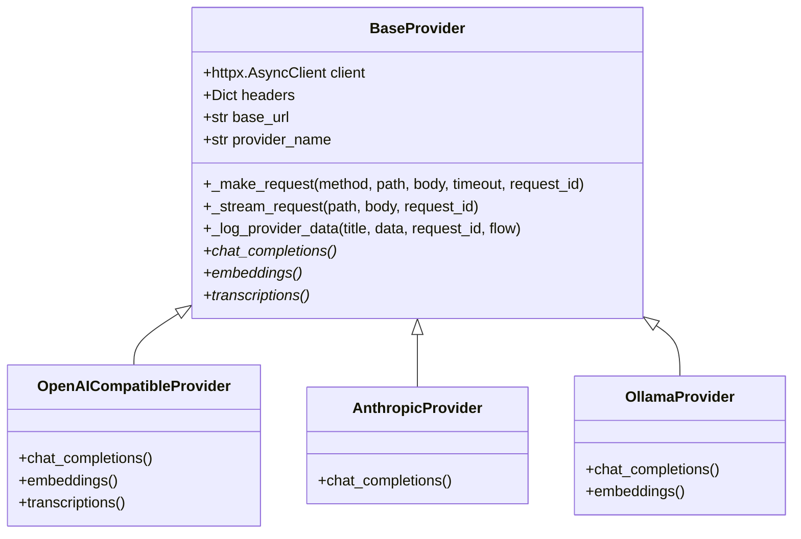
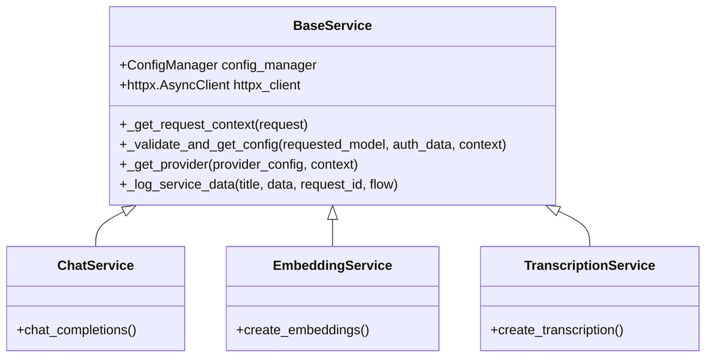

# Refactoring Design Document: Phase 1 & Phase 2

## Overview
This document outlines the refactoring plan for the Provider Layer (Phase 1) and Service Layer (Phase 2) of the `nnp-ai-router` project. The primary goals are to reduce code redundancy, improve maintainability, and preserve/enhance logging and error handling.

**Total Expected Code Reduction:** ~350 lines.

---

## Phase 1: Provider Layer Refactoring

### Architecture Diagram

### Detailed Design
1.  **`BaseProvider` Enhancements**:
    -   **`_make_request`**: A unified method for all non-streaming HTTP requests. It will handle:
        -   Request logging via `logger.debug_data`.
        -   Timeout configuration (standardized).
        -   `httpx` execution.
        -   `response.raise_for_status()`.
        -   Response logging via `logger.debug_data`.
        -   Centralized error handling (catching `httpx` exceptions and wrapping them using `ErrorHandler`).
    -   **`_log_provider_data`**: A helper method to standardize `logger.debug_data` calls across all providers.
    -   **Standardized Timeouts**: Move timeout logic to `BaseProvider`, allowing subclasses to pass specific values or use defaults from `ConfigManager`.

2.  **Subclass Refactoring**:
    -   `OpenAICompatibleProvider`, `AnthropicProvider`, and `OllamaProvider` will be refactored to use `_make_request` and `_stream_request`.
    -   Remove duplicate `try-except` blocks and logging calls in each subclass.
    -   Subclasses will focus only on **request transformation** (mapping OpenAI-like params to provider-specific params) and **response mapping**.

### Implementation Steps
1.  Modify [`src/providers/base.py`](src/providers/base.py) to include `_make_request` and `_log_provider_data`.
2.  Update `BaseProvider.__init__` to set `self.provider_name` automatically.
3.  Refactor `OpenAICompatibleProvider.chat_completions`, `.embeddings`, and `.transcriptions` to use `_make_request`.
4.  Refactor `AnthropicProvider.chat_completions` to use `_make_request`.
5.  Refactor `OllamaProvider.chat_completions` and `.embeddings` to use `_make_request`.

### Risk Mitigation
-   **Risk**: Breaking provider-specific variations (e.g., Anthropic's unique headers or Ollama's local timeouts).
-   **Mitigation**: Ensure `_make_request` accepts optional `headers`, `timeout`, and `files` parameters to accommodate variations.

---

## Phase 2: Service Layer Refactoring

### Architecture Diagram

### Detailed Design
1.  **`BaseService` Class**:
    -   Create `src/services/base.py`.
    -   **`_validate_and_get_config`**: Centralize model existence checks, permission checks (against `allowed_models`), and configuration retrieval.
    -   **`_get_provider`**: Centralize the logic for calling `get_provider_instance` and handling potential configuration errors.
    -   **`_get_request_context`**: Standardize extraction of `request_id` and `user_id` from the FastAPI `Request` object.
    -   **`_log_service_data`**: Standardize incoming request and outgoing response logging.

2.  **Service Refactoring**:
    -   `ChatService`, `EmbeddingService`, and `TranscriptionService` will inherit from `BaseService`.
    -   Remove redundant validation and instantiation logic.
    -   Standardize the use of `logger.request_context`.

### Implementation Steps
1.  Create [`src/services/base.py`](src/services/base.py) with the `BaseService` class.
2.  Refactor [`src/services/chat_service/chat_service.py`](src/services/chat_service/chat_service.py) to inherit from `BaseService` and use its helper methods.
3.  Refactor [`src/services/embedding_service.py`](src/services/embedding_service.py) similarly.
4.  Refactor [`src/services/transcription_service.py`](src/services/transcription_service.py) similarly.

### Risk Mitigation
-   **Risk**: Inconsistent `request_id` handling across services.
-   **Mitigation**: Use a unified `_get_request_context` method in `BaseService` to ensure `request_id` is always present and correctly logged.

---

## Testing Strategy
1.  **Unit Tests**:
    -   Verify `BaseProvider._make_request` correctly handles various HTTP methods and error codes.
    -   Verify `BaseService._validate_and_get_config` correctly enforces permissions.
2.  **Integration Tests**:
    -   Run existing API tests ([`tests/api/test_chat_completions.py`](tests/api/test_chat_completions.py), [`tests/api/test_embeddings.py`](tests/api/test_embeddings.py), [`tests/api/test_transcriptions.py`](tests/api/test_transcriptions.py)) to ensure no regressions in functionality.
3.  **Logging Verification**:
    -   Manually trigger requests and verify that `debug_data` logs still contain all necessary information for debugging.

---

## Documentation Requirements
-   Update docstrings for all new methods in `BaseProvider` and `BaseService`.
-   Ensure all refactored methods in subclasses have clear documentation explaining their specific transformation logic.
-   Maintain the existing high standard of Russian/English comments where appropriate.

---

## Expected Metrics
-   **Phase 1 Reduction**: ~200 lines (centralizing HTTP calls, error handling, and logging).
-   **Phase 2 Reduction**: ~150 lines (centralizing validation and provider instantiation).
-   **Total Reduction**: ~350 lines.
-   **Maintainability**: Significant improvement by reducing the number of places where API changes or logging updates need to be applied.
